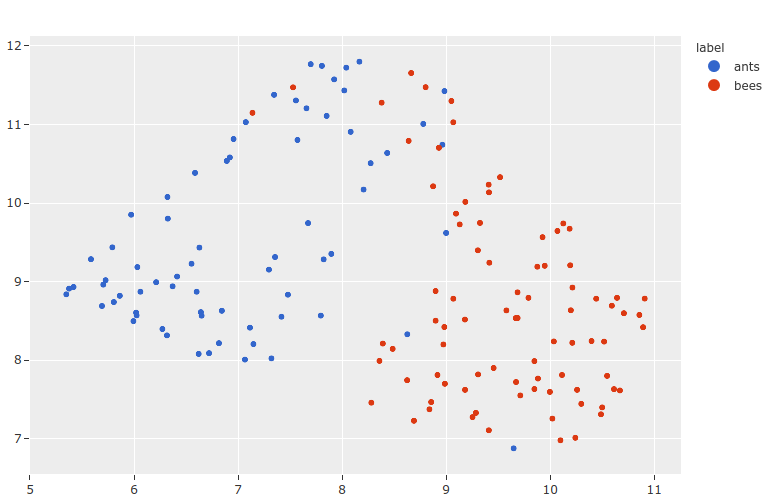

Table of Contents

- [Docs](../index.html) >

- [FiftyOne Integrations](index.html) >
- Lightning Flash Integration

Contents


# Lightning Flash Integration [¶](\#lightning-flash-integration "Permalink to this headline")

We’ve collaborated with the
[PyTorch Lightning](https://github.com/PyTorchLightning/pytorch-lightning)
team to make it easy to train
[Lightning Flash](https://github.com/PyTorchLightning/lightning-flash) tasks
on your [FiftyOne datasets](../fiftyone_concepts/using_datasets.html#using-datasets) and add predictions from your
Flash models to your FiftyOne datasets for visualization and analysis, all in
just a few lines of code!

The following Flash tasks are supported natively by FiftyOne:

- [Image classification](https://lightning-flash.readthedocs.io/en/latest/reference/image_classification.html#image-classification "(in Flash)")

- [Object detection](https://lightning-flash.readthedocs.io/en/latest/reference/object_detection.html#object-detection "(in Flash)")

- [Semantic segmentation](https://lightning-flash.readthedocs.io/en/latest/reference/semantic_segmentation.html#semantic-segmentation "(in Flash)")

- [Video classification](https://lightning-flash.readthedocs.io/en/latest/reference/video_classification.html#video-classification "(in Flash)")

- [Image embeddings](https://lightning-flash.readthedocs.io/en/latest/reference/image_embedder.html#image-embedder "(in Flash)")


Note

As Lightning Flash adds support for additional computer vision tasks, we’ll
roll out native support for them in FiftyOne via this integration!

## Setup [¶](\#setup "Permalink to this headline")

In order to use the Lightning Flash integration, you’ll need to
[install Flash](https://lightning-flash.readthedocs.io/en/latest/installation.html):

```
# This integration currently requires these versions explicitly
pip install lightning-flash>=0.7.0dev
pip install pytorch-lightning

```

Depending on the type of Flash tasks that you intend to use, you will also need
to install some package extras:

```
# Required to use image tasks
pip install 'lightning-flash[image]'

# Required to use video tasks
pip install 'lightning-flash[video]'

```

You can always proceed without these initially, as you’ll be prompted to
install the appropriate extras when you use a feature that requires them.

## Model training [¶](\#model-training "Permalink to this headline")

You can easily train or finetune a Flash
[`Task`](https://lightning-flash.readthedocs.io/en/latest/api/generated/flash.core.model.Task.html#flash.core.model.Task "(in Flash)") on your
[FiftyOne datasets](../fiftyone_concepts/using_datasets.html#using-datasets) with just a few lines of code using
Flash’s builtin
`DataModule.from_fiftyone()`
method, which is implemented for each of the Flash tasks shown below.

## Model predictions [¶](\#model-predictions "Permalink to this headline")

Once you have a trained Flash task, you can add model predictions to a FiftyOne
[`Dataset`](../api/fiftyone.core.dataset.html#fiftyone.core.dataset.Dataset "fiftyone.core.dataset.Dataset") or [`DatasetView`](../api/fiftyone.core.view.html#fiftyone.core.view.DatasetView "fiftyone.core.view.DatasetView") in just a few lines of code using either of the
patterns below.

### Applying Flash models to FiftyOne datasets [¶](\#applying-flash-models-to-fiftyone-datasets "Permalink to this headline")

The easiest way to generate predictions on a FiftyOne [`Dataset`](../api/fiftyone.core.dataset.html#fiftyone.core.dataset.Dataset "fiftyone.core.dataset.Dataset") or
[`DatasetView`](../api/fiftyone.core.view.html#fiftyone.core.view.DatasetView "fiftyone.core.view.DatasetView") with a Flash model is to use the
builtin [`apply_model()`](../api/fiftyone.core.collections.html#fiftyone.core.collections.SampleCollection.apply_model "fiftyone.core.collections.SampleCollection.apply_model")
function, which natively accepts Flash models of any
[supported type](#lightning-flash).

Behind the scenes, FiftyOne will construct the appropriate Flash
`Trainer` and FiftyOne-style
[`Output`](https://lightning-flash.readthedocs.io/en/latest/api/generated/flash.core.data.io.output.Output.html#flash.core.data.io.output.Output "(in Flash)") to perform the
inference and output the predictions as [`Label`](../api/fiftyone.core.labels.html#fiftyone.core.labels.Label "fiftyone.core.labels.Label") instances that are added to
your dataset.

```
from flash.core.classification import FiftyOneLabelsOutput
from flash.image import ImageClassifier, ObjectDetector

import fiftyone as fo
import fiftyone.zoo as foz

# Load your dataset
dataset = foz.load_zoo_dataset("quickstart", max_samples=5)
num_classes = len(dataset.distinct("ground_truth.detections.label"))

# Load your Flash model
cls_model = ImageClassifier(
    backbone="resnet18", num_classes=num_classes
)

det_model = ObjectDetector(
    head="efficientdet",
    backbone="d0",
    num_classes=91,
    image_size=512,
)

# Predict!
dataset.apply_model(
    cls_model, label_field="flash_classifications",
)

# Some models require transform kwargs that can be pass in
transform_kwargs = {"image_size": 512}
dataset.apply_model(
    det_model,
    label_field="flash_detections",
    transform_kwargs=transform_kwargs,
)

```

Note

When performing inference with Flash models, you can pass additional
`trainer_kwargs` in a dictionary like `trainer_kwargs={"gpus": 8}` to
[`apply_model()`](../api/fiftyone.core.collections.html#fiftyone.core.collections.SampleCollection.apply_model "fiftyone.core.collections.SampleCollection.apply_model"),
which are used to initialize the Flash
`Trainer` to configure distributed and/or
parallelized inference! See
`apply_flash_model()`
for more details about supported keyword arguments.

### Manually adding predictions [¶](\#manually-adding-predictions "Permalink to this headline")

If you’ve already loaded your datasets into Flash
[`DataModules`](https://lightning-flash.readthedocs.io/en/latest/api/generated/flash.core.data.data_module.DataModule.html#flash.core.data.data_module.DataModule "(in Flash)") without
using FiftyOne, you can still easily use FiftyOne to analyze your model’s
predictions by providing the
[`Output`](https://lightning-flash.readthedocs.io/en/latest/api/generated/flash.core.data.io.output.Output.html#flash.core.data.io.output.Output "(in Flash)") for the
FiftyOne-style output of the appropriate
type when generating predictions.

Specifying FiftyOne outputs will result in predictions returned as
[`Label`](../api/fiftyone.core.labels.html#fiftyone.core.labels.Label "fiftyone.core.labels.Label") objects that you can easily add to your FiftyOne datasets via
[`set_values()`](../api/fiftyone.core.collections.html#fiftyone.core.collections.SampleCollection.set_values "fiftyone.core.collections.SampleCollection.set_values").

```
from itertools import chain

from flash import Trainer
from flash.core.classification import FiftyOneLabelsOutput
from flash.image import ImageClassificationData, ImageClassifier

import fiftyone as fo
import fiftyone.zoo as foz

# Load your dataset
dataset = foz.load_zoo_dataset("quickstart", max_samples=5)
labels = dataset.distinct("ground_truth.detections.label")

# Load your Flash model
model = ImageClassifier(labels=labels)

# Create prediction datamodule
datamodule = ImageClassificationData.from_fiftyone(
    predict_dataset=dataset,
    batch_size=1,
)

# Output FiftyOne format
output = FiftyOneLabelsOutput(
    return_filepath=False, labels=labels
)
# Predict with trainer
predictions = Trainer().predict(model, datamodule=datamodule, output=output)

predictions = list(chain.from_iterable(predictions))  # flatten batches

# Predictions is a list of Label objects since ``return_filepath=False``
# Order corresponds to order of the ``predict_dataset``

# Add predictions to dataset
dataset.set_values("flash_predictions", predictions)

# Visualize in the App
session = fo.launch_app(dataset)

```

Note

FiftyOne outputs have an optional
[`return_filepath=False`](https://lightning-flash.readthedocs.io/en/latest/api/generated/flash.core.classification.FiftyOneLabelsOutput.html#flash.core.classification.FiftyOneLabelsOutput "(in Flash)")
flag that supports returning a list of [`Label`](../api/fiftyone.core.labels.html#fiftyone.core.labels.Label "fiftyone.core.labels.Label") objects corresponding to the
sample ordering of the `predict_dataset` rather than the default dicts
that contain both the [`Label`](../api/fiftyone.core.labels.html#fiftyone.core.labels.Label "fiftyone.core.labels.Label") objects and the `filepath` of the
associated media.

### Specifying class names [¶](\#specifying-class-names "Permalink to this headline")

Generally, Flash model checkpoints will contain the class label strings for the
model. However, if necessary, you can also explicitly pass the labels to most
[`Output`](https://lightning-flash.readthedocs.io/en/latest/api/generated/flash.core.data.io.output.Output.html#flash.core.data.io.output.Output "(in Flash)") instances,
FiftyOne-style outputs included:

```
import fiftyone as fo
import fiftyone.zoo as foz

from flash import Trainer
from flash.image import ImageClassificationData, ImageClassifier
from flash.core.classification import FiftyOneLabelsOutput

# Load your dataset
dataset = foz.load_zoo_dataset("quickstart", max_samples=5)

datamodule = ImageClassificationData.from_fiftyone(
    predict_dataset=dataset, batch_size=1
)

# Load your Flash model
num_classes = 100
model = ImageClassifier(backbone="resnet18", num_classes=num_classes)

# Configure output with class labels
labels = [\
    "label_" + str(i) for i in range(num_classes)\
]  # example class labels
output = FiftyOneLabelsOutput(
    labels=labels
)  # output FiftyOne format

# Predict with model
trainer = Trainer()
predictions = trainer.predict(
    model, datamodule=datamodule, output=output
)

predictions = list(chain.from_iterable(predictions))  # flatten batches

# Map filepaths to predictions
predictions = {p["filepath"]: p["predictions"] for p in predictions}

# Add predictions to dataset
dataset.set_values(
    "flash_predictions", predictions, key_field="filepath"
)

print(dataset.distinct("flash_predictions.label"))
# ['label_57', 'label_60']

# Visualize in the App
session = fo.launch_app(dataset)

```

## Image embeddings [¶](\#image-embeddings "Permalink to this headline")

If you use Lightning Flash’s
[image embeddings tasks](https://lightning-flash.readthedocs.io/en/latest/reference/image_embedder.html#image-embedder "(in Flash)") to generate feature
vectors for your image datasets, then use can easily leverage FiftyOne’s
[dimensionality reduction](../brain.html#brain-embeddings-visualization) and
[interactive plotting](../fiftyone_concepts/plots.html#embeddings-plots) capabilities to visualize your
Flash model’s embeddings and execute powerful workflows like
[cluster analysis](../tutorials/image_embeddings.html) and
[similarity search](../fiftyone_concepts/app.html#app-similarity), all in only a few lines of code!

```
import numpy as np

from flash.core.data.utils import download_data
from flash.image import ImageClassificationData, ImageEmbedder
from flash import Trainer

import fiftyone as fo
import fiftyone.brain as fob

# 1 Download data
download_data(
    "https://pl-flash-data.s3.amazonaws.com/hymenoptera_data.zip",
    "/tmp",
)

# 2 Load data into FiftyOne
dataset = fo.Dataset.from_dir(
    "/tmp/hymenoptera_data/test/",
    fo.types.ImageClassificationDirectoryTree,
)
datamodule = ImageClassificationData.from_fiftyone(
    predict_dataset=dataset,
    batch_size=1,
)

# 3 Load model
embedder = ImageEmbedder(
    backbone="vision_transformer",
    training_strategy="barlow_twins",
    head="barlow_twins_head",
    pretraining_transform="barlow_twins_transform",
    training_strategy_kwargs={"latent_embedding_dim": 128},
    pretraining_transform_kwargs={"size_crops": [32]},
)

# 4 Generate embeddings
trainer = Trainer()
embeddings = trainer.predict(embedder, datamodule=datamodule)
embeddings = np.stack(sum(embedding_batches, []))

# 5 Visualize images
session = fo.launch_app(dataset)

# 6 Visualize image embeddings
results = fob.compute_visualization(dataset, embeddings=embeddings)
plot = results.visualize(labels="ground_truth.label")
plot.show()

```

Note

You can also directly pass your Flash embedding model to
[`compute_embeddings()`](../api/fiftyone.core.collections.html#fiftyone.core.collections.SampleCollection.compute_embeddings "fiftyone.core.collections.SampleCollection.compute_embeddings")
and let FiftyOne handle performing the inference!



- Lightning Flash Integration
  - [Setup](#setup)
  - [Model training](#model-training)
  - [Model predictions](#model-predictions)
    - [Applying Flash models to FiftyOne datasets](#applying-flash-models-to-fiftyone-datasets)
    - [Manually adding predictions](#manually-adding-predictions)
    - [Specifying class names](#specifying-class-names)
  - [Image embeddings](#image-embeddings)