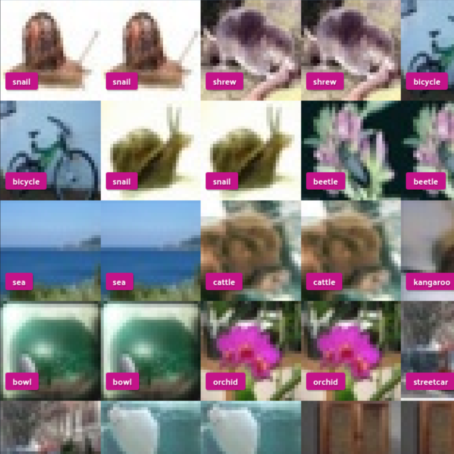
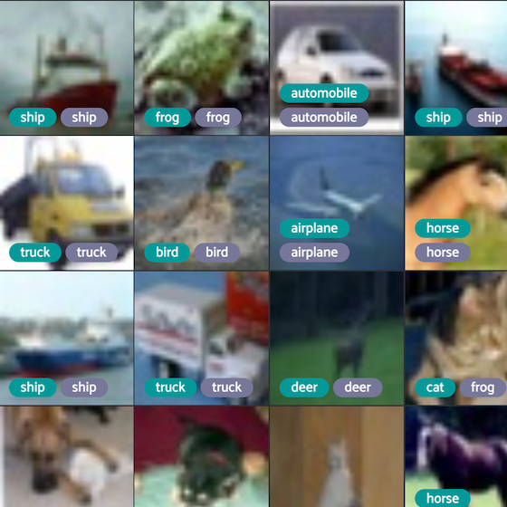
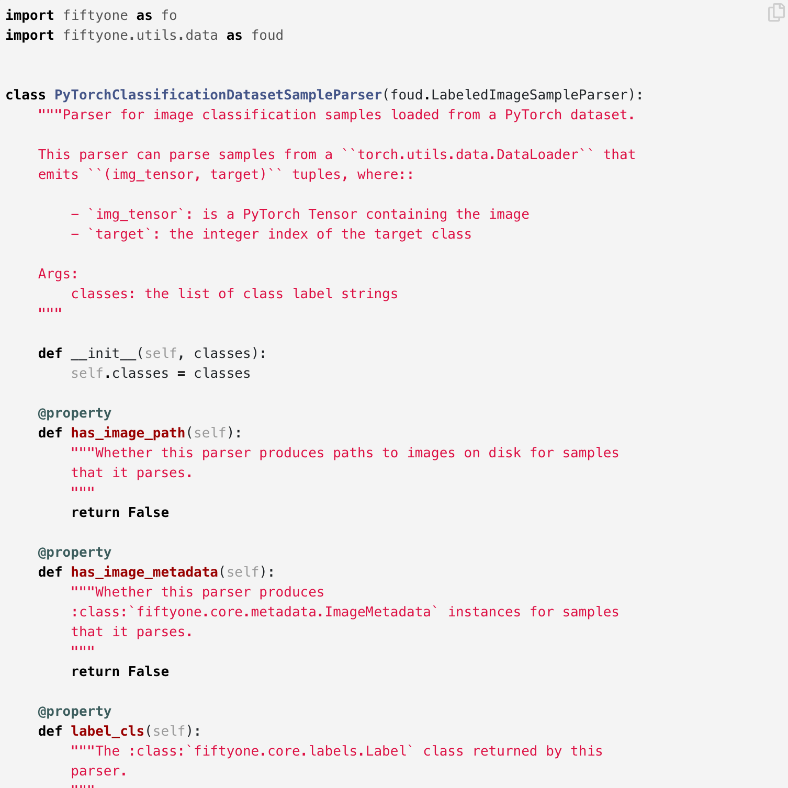

# FiftyOne Recipes [¶](\#fiftyone-recipes "Permalink to this headline")

FiftyOne turbocharges your current workflows, transforming hours of scripting
into minutes so that you can focus on your models. Browse the recipes below to
see how you can leverage FiftyOne to enhance key parts of your machine learning
workflows.

* * *

#### Creating views and using view expressions

Create views to easily query and explore your datasets in FiftyOne.

Basics,Dataset-Curation

#### Removing duplicate images from a dataset

Automatically find and remove duplicate and near-duplicate images from your FiftyOne datasets.

Basics,Dataset-Curation

#### Removing duplicate objects from a dataset

Check out some common workflows for finding and removing duplicate objects from your FiftyOne datasets.

Basics,Dataset-Curation

#### Adding classifier predictions to a dataset

Add FiftyOne to your model training and analysis loop to visualize and analyze your classifier's predictions.

Basics,Model-Training

#### Adding object detections to a dataset

Use FiftyOne to store your object detections and use the FiftyOne App to analyze them.

Basics,Model-Training

#### Draw labels on samples

Render labels on the samples in your FiftyOne Dataset with a single line of code.

Basics,Visualization

#### Convert dataset formats on disk

Use FiftyOne's powerful dataset import/export features to convert your datasets on disk between standard (or custom) formats.

Basics,I/O

#### Merging datasets

Easily merge datasets on disk or in-memory using FiftyOne; e.g., to add a new set of model predictions to a dataset.

Basics,I/O

#### Import datasets in custom formats

Write your own custom DatasetImporter and use it to import datasets in your custom format into FiftyOne.

Advanced,I/O

#### Export datasets in custom formats

Write your own custom DatasetExporter and use it to export a FiftyOne Dataset to disk in your custom format.

Advanced,I/O

#### Parse samples in custom formats

Write your own custom SampleParser and use it to add samples in your custom format to a FiftyOne Dataset.

Advanced,I/O

Note

Check out the
[fiftyone-examples](https://github.com/voxel51/fiftyone-examples)
repository for more examples of using FiftyOne!

