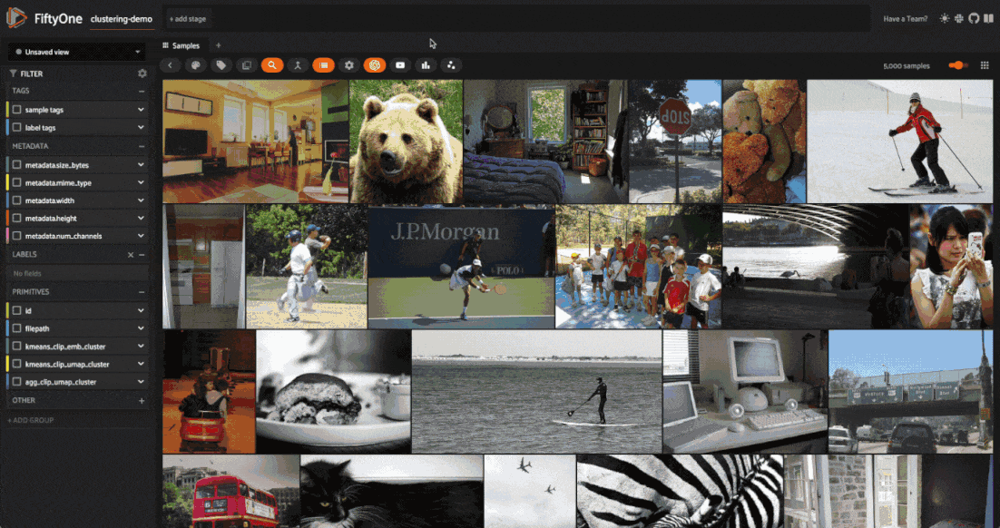
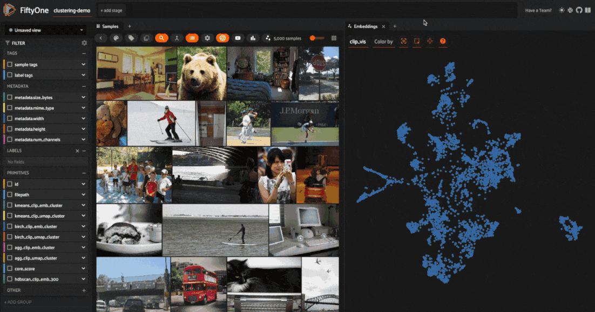
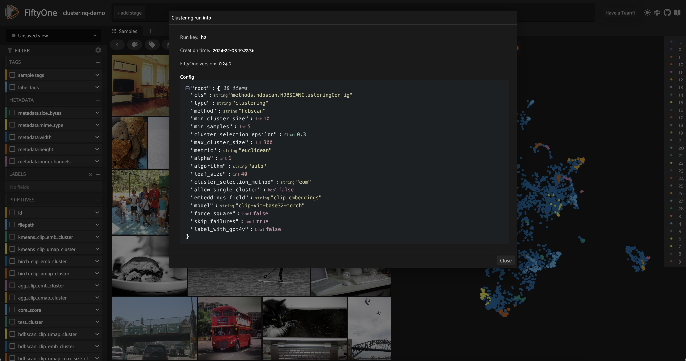

# Clustering Images with Embeddings [¶](\#Clustering-Images-with-Embeddings "Permalink to this headline")


[Clustering](https://en.wikipedia.org/wiki/Cluster_analysis) is an essential unsupervised learning technique that can help you discover hidden patterns in your data. This walkthrough, you’ll learn how to bring structure your visual data using Scikit-learn and FiftyOne!

It covers the following:

- What is clustering?

- Generating features to cluster images

- Clustering images using the FiftyOne Clustering Plugin

- Keeping track of clustering runs in the FiftyOne App

- Assigning labels to clusters using GPT-4V


## What is Clustering? [¶](\#What-is-Clustering? "Permalink to this headline")

### The Building Blocks of Clustering [¶](\#The-Building-Blocks-of-Clustering "Permalink to this headline")

Imagine you have a ton of Lego blocks of all shapes and sizes spread out on the floor. It’s time to put the legos away, and you realize you don’t have a large enough bin to store all of them. Luckily, you find four smaller bins that can each hold roughly the same number of pieces. You _could_ dump a random assortment of Legos in each bin and call it a day. But then, the next time you went to find a specific piece, you’d have quite the time digging around for it.

Instead, you have a better idea: putting similar pieces in the same bin would save you a lot of time and trouble later. But what _criterion_ are you going to use to put Legos in bins? Are you going to assign bins for different colors? Or put all the square pieces in one bin and the circular pieces in another? It really depends on what Legos you have! This, in a nutshell, is clustering.

More formally, [clustering](https://en.wikipedia.org/wiki/Cluster_analysis), or _cluster analysis_, is a set of techniques for _grouping_ data points. Clustering algorithms take in a bunch of objects, and spit out assignments for each object. Unlike classification, however, clustering does not start with a list of classes to categorize the objects, forcing objects to fall into preset buckets. Rather, clustering attempts to _discover_ the buckets given the data. In other words, clustering is
about _uncovering_ structure in data, not predicting labels in a preexisting structure.

This last point merits repeating: _clustering is not about predicting labels_. Unlike classification, detection, and segmentation tasks, there are no ground truth labels for clustering tasks. We call algorithms like this [unsupervised](https://cloud.google.com/discover/what-is-unsupervised-learning), contrasting with [supervised](https://cloud.google.com/discover/what-is-supervised-learning) and [self-supervised](https://en.wikipedia.org/wiki/Self-supervised_learning) learning tasks.

To hammer it home, clustering is _training-free_. A clustering algorithm will take in features of your data points (the objects) and use those features to split your objects into groups. When successful, those groups highlight unique characteristics, giving you a view into the structure of your data.

💡 This means that clustering is an extremely powerful tool for exploring your data—especially when your data is unlabeled!

### How Clustering Works [¶](\#How-Clustering-Works "Permalink to this headline")

If you’ve been paying close attention, you may have noticed the distinction subtly drawn between _clustering_ and _clustering algorithms_. This is because clustering is an umbrella term encompassing various techniques!

Clustering algorithms come in a few flavors, distinguished by the criterion they use to assign cluster membership. A few of the most common flavors of clustering are:

**Centroid-based clustering**: for example, techniques like [K-means](https://scikit-learn.org/stable/modules/clustering.html#k-means) and [Mean Shift](https://scikit-learn.org/stable/modules/clustering.html#mean-shift) clustering. These methods try to find central points by which to define each cluster, called _centroids_, which seek to maximize some notion of coherence between points _within_ a cluster. This flavor of clustering scales well to large datasets but is sensitive to outliers
and random initialization. Often, multiple runs are performed, and the best one is chosen. You may find that techniques like K-means struggle with high-dimensional data — “the curse of dimensionality” — and can better uncover structure when paired with dimensionality reduction techniques like uniform manifold approximation & projection ( [UMAP](https://umap-learn.readthedocs.io/en/latest/)). We’ll explain how to pair the two below.

**Density-based clustering**: techniques like [DBSCAN](https://scikit-learn.org/stable/modules/clustering.html#dbscan), [HDBSCAN](https://scikit-learn.org/stable/modules/clustering.html#hdbscan), and [OPTICS](https://scikit-learn.org/stable/modules/clustering.html#optics) select clusters based on how sparsely or densely populated the feature space is. Conceptually, these algorithms treat high-density regions as clusters, breaking the clusters off when the points become sufficiently
spread out in feature space. Simple density-based techniques like DBSCAN can have difficulty working with high-dimensional data, where data may not be densely colocated. However, more sophisticated techniques like HDBSCAN can overcome some of these limitations and uncover remarkable structure from high dimensional features.

**Hierarchical clustering**: These techniques seek to either:

1. _Construct_ clusters by starting with individual points and iteratively combining clusters into larger composites or

2. _Deconstruct_ clusters, starting with all objects in one cluster and iteratively diving clusters into smaller components.


Constructive techniques like [Agglomerative Clustering](https://scikit-learn.org/stable/modules/clustering.html#hierarchical-clustering) become computationally expensive as the dataset grows, but performance can be quite impressive for small-to-medium datasets and low-dimensional features.

📚 For a comprehensive discussion on 10+ of the most commonly used clustering algorithms, check out this intuitive, [well-written guide from Scikit-learn](https://scikit-learn.org/stable/modules/clustering.html)!

### What Features Do I Cluster On? [¶](\#What-Features-Do-I-Cluster-On? "Permalink to this headline")

For the Lego bricks we started this discussion with, the features (length, width, height, curvature, etc.) are independent entities we can view as columns in a data table. After normalizing this data so that no one feature dominates the others, we could pass a row of numerical values as a _feature vector_ into our clustering algorithm for each Lego block. Historically, clustering has had many applications like this, operating on lightly preprocessed numerical values from data tables or time
series.

Unstructured data like images don’t fit quite as nicely into this framework for a few simple reasons:

1. Images can vary in size (aspect ratio and resolution)

2. Raw pixel values can be very noisy

3. Correlations between pixels can be highly nonlinear


If we were to go through the trouble of reshaping and standardizing all of our image sizes, normalizing pixel values, denoising, and flattening the multidimensional arrays into “feature vectors”, treating these processed pixel arrays as features would put a tremendous amount of stress on the _unsupervised_ clustering algorithm to uncover structure. This can work for simple datasets like [MNIST](https://docs.voxel51.com/user_guide/dataset_zoo/datasets.html#mnist), but it is often not an option
in practice.

Fortunately, we have [powerful nonlinear function approximation tools](https://en.wikipedia.org/wiki/Universal_approximation_theorem) called deep neural networks! Restricting our attention to the image domain, we have models like [CLIP](https://docs.voxel51.com/user_guide/model_zoo/models.html#clip-vit-base32-torch) and [DINOv2](https://docs.voxel51.com/user_guide/model_zoo/models.html#dinov2-vitl14-torch) whose output is a meaningful representation of the input data, and we have models
trained for specific tasks like image classification, from which we typically take the [outputs of the second to last layer](https://medium.com/vector-database/how-to-get-the-right-vector-embeddings-83295ced7f35) of the network. There are also variational autoencoder (VAE) networks, from which it is common to take the representation at the middle layer!

💡Different models have different architectures, and were trained on different datasets and towards different tasks. All of these elements inform the types of features a model learns. Do your homework 📚:)

## Clustering Images with FiftyOne and Scikit-learn [¶](\#Clustering-Images-with-FiftyOne-and-Scikit-learn "Permalink to this headline")

### Setup and Installation [¶](\#Setup-and-Installation "Permalink to this headline")

With all that background out of the way, let’s turn theory into practice and learn how to use clustering to structure our unstructured data. We’ll be leveraging two open-source machine learning libraries: [scikit-learn](https://scikit-learn.org/stable/index.html), which comes pre-packaged with [implementations of most common clustering algorithms](https://scikit-learn.org/stable/modules/clustering.html), and fiftyone, which streamlines the management and visualization of unstructured data:

```python
[ ]:

```

```python
!pip install -U scikit-learn fiftyone

```

The [FiftyOne Clustering Plugin](https://github.com/jacobmarks/clustering-runs-plugin) makes our lives even easier. It provides the connective tissue between scikit-learn’s clustering algorithms and our images and wraps all of this in a simple UI within the [FiftyOne App](https://docs.voxel51.com/user_guide/app.html). We can install the plugin from the CLI:

```python
[ ]:

```

```python
!fiftyone plugins download https://github.com/jacobmarks/clustering-plugin

```

We will also need two more libraries: [OpenAI’s CLIP GitHub repo](https://github.com/openai/CLIP), enabling us to generate image features with the CLIP model, and the [umap-learn](https://umap-learn.readthedocs.io/en/latest/) library, which will let us apply a dimensionality reduction technique called Uniform Manifold Approximation and Projection (UMAP) to those features to visualize them in 2D:

```python
[ ]:

```

```python
!pip install umap-learn git+https://github.com/openai/CLIP.git

```

Note that neither of these two libraries is strictly necessary — you could generate features with any model from the [FiftyOne Model Zoo](https://docs.voxel51.com/user_guide/model_zoo/index.html) that exposes embeddings, and can perform [dimensionality reduction](https://docs.voxel51.com/tutorials/dimension_reduction.html) with alternative techniques like PCA or tSNE.

Once you have all of the necessary libraries installed, in a Python process, import the relevant FiftyOne modules, and load a dataset from the [FiftyOne Dataset Zoo](https://docs.voxel51.com/user_guide/dataset_zoo/index.html) (or your data if you’d like!). For this walkthrough, we’ll be using the validation split (5,000 samples) from the [MS COCO](https://docs.voxel51.com/user_guide/dataset_zoo/datasets.html#dataset-zoo-coco-2017) dataset:

```python
[ ]:

```

```python
import fiftyone as fo
import fiftyone.brain as fob
import fiftyone.zoo as foz
from fiftyone import ViewField as F

# load dataset from the zoo, rename, and persist to database
dataset = foz.load_zoo_dataset("coco-2017", split="validation")
# delete labels to simulate starting with unlabeled data
dataset.select_fields().keep_fields()
dataset.name = "clustering-demo"
dataset.persistent = True

# launch the app to visualize the dataset
session = fo.launch_app(dataset)

```

If you’re working in a Jupyter Notebook, you can pass auto=False and then open a tab in your browser to wherever `session.url` is pointing (typically ​​ [http://localhost:5151/](​​http://localhost:5151/)) to see the app in its full glory.


### Generating Features [¶](\#Generating-Features "Permalink to this headline")

Now that we have our data, we must generate the features we will use to cluster. For this walkthrough, we will look at two different features: the 512-dimensional vectors generated by our CLIP Vision Transformer and the two-dimensional vectors generated by running these high-dimensional vectors through a UMAP dimensionality reduction routine.

To run dimensionality reduction on a FiftyOne sample collection, we will use the FiftyOne Brain’s `compute_visualization()` function, which supports UMAP, PCA, and tSNE via the method keyword argument. We could generate the CLIP embeddings using our dataset’s `compute_embeddings()` method and then explicitly pass this into our dimensionality reduction routine. But instead, we can kill two birds with one stone by implicitly telling `compute_visualization()` to compute embeddings using CLIP
and store these embeddings in a field `”clip_embeddings”`, then use these to get 2D representations:

```python
[ ]:

```

```python
res = fob.compute_visualization(
    dataset,
    model="clip-vit-base32-torch",
    embeddings="clip_embeddings",
    method="umap",
    brain_key="clip_vis",
    batch_size=10
)
dataset.set_values("clip_umap", res.current_points)

```

The `brain_key` argument allows us to access these results by name, either programmatically or in the FiftyOne App moving forward. The last line takes the array of 2D vectors we generated and stores them in a new field `”clip_umap”` on our dataset.

Refreshing the app and opening an [Embeddings Panel](https://docs.voxel51.com/user_guide/app.html#embeddings-panel), we should see a 2D representation of our dataset, where each point in the plot corresponds to a single image:


### Computing and Visualizing Clusters [¶](\#Computing-and-Visualizing-Clusters "Permalink to this headline")

With our feature vectors in hand, we can use the FiftyOne Clustering Plugin to bring structure to our data. In the FiftyOne App, press the backtick key on your keyboard and type `compute_clusters`. Click on the entry in the dropdown to open the clustering modal.


Enter a `run_key` (similar to the `brain_key` above) to access the clustering run’s results. As you do so, watch the input form dynamically update. At this point, you have two key decisions to make: what features to cluster on and which clustering algorithm to employ!

Select `”kmeans”` as your clustering method and `”clip_umap”` as your feature vectors. Set the number of clusters to 20, using the default values for all other parameters. Hit enter and let the clustering algorithm run. It should only take a few seconds.

Once the computation finishes, notice the new field on your samples containing string representations of integers, which signify which cluster a given sample was assigned to. You can filter on these values directly and view one cluster at a time in the sample grid:



What is _even more_ interesting is coloring by these cluster labels in our embeddings plot:



Visualizing your clusters like this allows you to sanity check the clustering routine and can provide an intuitive view into the structure of your data. In this example, we can see a cluster of teddy bears which is fairly well separated from the rest of our data. This clustering routine also uncovered a boundary between farm animals and more exotic animals like elephants and zebras.

Now, create a new clustering run, increasing the number of clusters to 30 (don’t forget to color the embeddings in this new field). Depending on a bit of randomness (all of the routine’s initializations are random), there’s a strong chance that elephants and zebras will now occupy their own clusters.

Returning to the initial set of clusters, let’s dig into one final area in the embeddings plot. Notice how a few images of people playing soccer got lumped into a cluster of primarily tennis images. This is because we passed 2D dimensionality reduced vectors into our clustering routine rather than the embedding vectors themselves. While 2D projections are helpful for visualization, and techniques like UMAP are fairly good at retaining structure, relative distances are not exactly preserved, and
some information is lost. Suppose we instead pass our CLIP embeddings directly into our clustering computation with the same hyperparameters. In that case, these soccer images are assigned to the same cluster as the rest of the soccer images, along with other field sports like frisbee and baseball:


💡 The key takeaway is that high-dimensional features are not better than low-dimensional ones or vice versa. Every choice comes with a trade-off. This is why you should experiment with different techniques, hyperparameters, and features.

To make this even more apparent, let’s use HDBSCAN as our clustering algorithm, which does not allow us to specify the number of clusters, replacing this with parameters like `min_cluster_size` and `max_cluster_size` along with criteria on which to merge clusters. We’ll use our CLIP embeddings as features, and as a rough starting point, we’ll say we only want clusters between 10 and 300 elements. If the cluster is too large, it may not be helpful; if it is too small, it may pick up on noise
rather than signal. The specific values are, of course, dataset-dependent!

When we color by our cluster labels, the results look a bit messy. However, when we look at the images for each cluster individually, we see that we identified some very interesting collections of samples in our dataset.


Note that for HDBSCAN, label `-1` is given to all background images. These images are not merged into any of the final clusters.

### Keeping Track of Clustering Runs [¶](\#Keeping-Track-of-Clustering-Runs "Permalink to this headline")

As you test out various combinations of features, clustering techniques, and hyperparameters, you may want to keep track of what “configuration” you used to generate a specific set of clusters. Fortunately, the FiftyOne Clustering Plugin handles all of this for you, using [custom runs](https://docs.voxel51.com/plugins/developing_plugins.html#storing-custom-runs). The plugin exposes an operator `get_clustering_run_info`, which lets you select a run by run\_key and view a nicely formatted
printout of all of the run’s parameters in the app:



You can also access this information programmatically by passing the `run_key` to the dataset’s `get_run_info()` method!

### Labeling Clusters with GPT-4V [¶](\#Labeling-Clusters-with-GPT-4V "Permalink to this headline")

Until now, our clusters have only had numbers, which we have used as a glorified housekeeping device. However, if we cluster for some specific characteristic in our dataset, we should be able to identify that and use it to label our samples loosely. Naively, we could go through our clusters individually, select and visualize just the images in a given cluster, and try to tag the cluster ourselves.

Or…we could use a multimodal large language model to do this for us! The FiftyOne Clustering Plugin provides this functionality, leveraging [GPT-4V](https://openai.com/research/gpt-4v-system-card)’s multimodal understanding capabilities to give each cluster a conceptual label.

To use this functionality, you must have an OpenAI API key environment variable (creating an account if necessary), which you can set as follows:

```python
[ ]:

```

```python
!export OPENAI_API_KEY=sk-...

```

This functionality is provided via the `label_clusters_with_gpt4v` operator, which randomly selects five images from each cluster, feeds them into GPT-4V with a task-specific prompt, and processes the results.

Depending on the number of clusters you have (GPT-4V can be slow, and this scales linearly in the number of clusters), you may want to [delegate execution](https://docs.voxel51.com/plugins/using_plugins.html#delegated-operations) of the operation by checking the box in the operator’s modal and then launch the job from the command line with:

```python
fiftyone delegated launch

```


## Conclusion [¶](\#Conclusion "Permalink to this headline")

In this walkthrough, we covered how to combine deep neural networks with popular clustering algorithms to bring structure to unstructured data using scikit-learn and FiftyOne. Along the way, we saw that the feature vectors, the algorithm, and the hyperparameter you choose can greatly impact the final results of clustering computations, both in terms of what the clusters select for and how well they identify structure in your data.

Once you have run these clustering routines on your data, a few key questions arise:

1. How do I quantitatively compare and contrast these clustering runs?

2. How do I synthesize the insights from multiple clustering runs to better understand my data?

3. How do I leverage these insights to train better models?


Answering these questions will help you reap the rewards of clustering.

If you want to dive deeper into the world of clustering, here are a few avenues that you may want to explore:

- **Choice of embedding model**: We used CLIP, a semantic foundation model for this walkthrough. See how things change when you use other semantic models from [Hugging Face’s Transformers library](https://docs.voxel51.com/integrations/huggingface.html#image-embeddings), or [OpenCLIP](https://docs.voxel51.com/integrations/openclip.html). Now see how the picture changes when you use a “pixels-and-patches” computer vision model like
[ResNet50](https://docs.voxel51.com/user_guide/model_zoo/models.html#resnet50-imagenet-torch), or a self–supervised model like [DINOv2](https://docs.voxel51.com/user_guide/model_zoo/models.html#dinov2-vitl14-torch).

- **Clustering Hyperparameters**: We barely touched the number of clusters in this walkthrough. Your results may vary as you increase or decrease this number. For some techniques, like k-means clustering, there are heuristics you can use to [estimate the optimal number of clusters](https://www.analyticsvidhya.com/blog/2021/05/k-mean-getting-the-optimal-number-of-clusters/). Don’t stop there; experiment with other hyperparameters as well!

- **Concept Modeling Techniques**: the built-in concept modeling technique in this walkthrough uses GPT-4V and some light prompting to identify each cluster’s core concept. This is but one way to approach an open-ended problem. Try using [image captioning](https://github.com/jacobmarks/image-captioning) and [topic modeling](https://en.wikipedia.org/wiki/Topic_model), or create your own technique!


