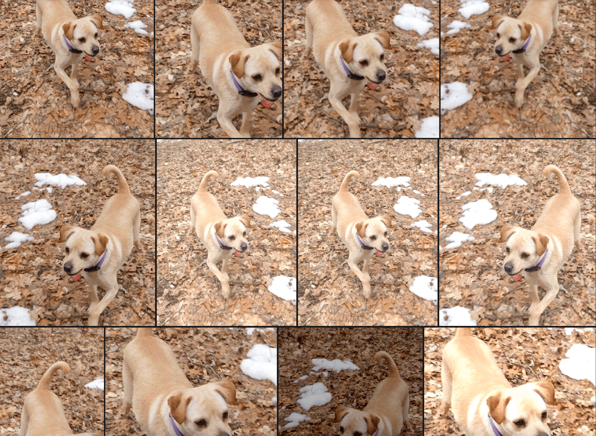
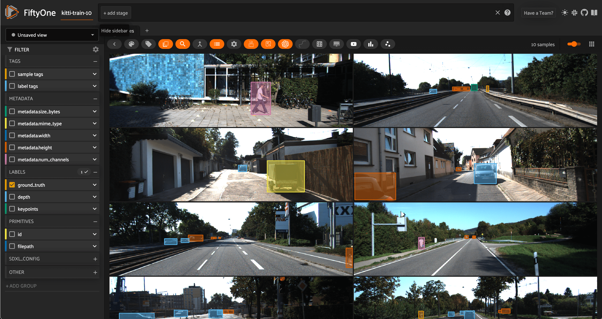

Table of Contents

- [Docs](../index.html) >

- [FiftyOne Tutorials](index.html) >
- Augmenting Datasets with Albumentations

Contents


# Augmenting Datasets with Albumentations [¶](\#Augmenting-Datasets-with-Albumentations "Permalink to this headline")

Traditionally, [data augmentation]((https://en.wikipedia.org/wiki/Data_augmentation)) is performed on-the-fly during training. This is great… _if_ you know exactly what augmentations you want to apply to your dataset.

However, if you’re just getting started with a new dataset, you may not know what augmentations are appropriate for your data. Should you include rotations? How much blurring is reasonable? Does it make sense to employ random cropping? These questions just scratch the surface.

When effective, data augmentation can significantly boost model performance by reducing overfitting and turning a small set of collected data into a much larger and more diverse data moat. But when left unchecked, data augmentation transformations can completely confuse your model, burying the original high quality data in a glut of digital garbage.

In this walkthrough, you’ll learn how to apply data augmentation to your dataset using the [Albumentations](https://albumentations.ai/) library, and how to ensure those augmentations are appropriate for your data.

It covers the following:

- What is data augmentation?

- The perils of blind data augmentation

- Testing transformations on your dataset


## What is Data Augmentation? [¶](\#What-is-Data-Augmentation? "Permalink to this headline")



Illustration of data augmentation applied to a single natural image

Broadly speaking, [data augmentation](https://en.wikipedia.org/wiki/Data_augmentation) is any process that involves increasing the size of the training set by modifying the original data. Typically, data augmentation is used to fill expected gaps in the original data and reduce overfitting to the specific data that you were able to collect and curate. It is also a [handy technique for mitigating class\\
imbalance](https://www.picsellia.com/post/improve-imbalanced-datasets-in-computer-vision): by augmenting the number of samples for underrepresented classes, you can restore balance to the training distribution. Often, augmentations can account for 90% of the training data, or even more.

In the context of computer vision, modifications can be made via geometric transformations like rotations and reflections, transformations which blur or add noise, or transformations that simulate different lighting conditions, such as changing the brightness, contrast, or saturation. For most of these augmentations, if you just need to transform the raw images, then torchvision’s `transforms` module is a great solution. If you want to take your labels (bounding boxes, masks, and keypoints)
along for the ride, then you’ll need a purpose-built image augmentation library, such as [Albumentations](https://albumentations.ai/), [imgaug](https://imgaug.readthedocs.io/en/latest/), or [Augmentor](https://augmentor.readthedocs.io/en/master/).

There are also more sophisticated image augmentation techniques for changing the scenery, background, and weather conditions in images. If you’re interested in this level of control over your augmentations, check out [Kopikat](https://www.kopikat.co/) and Stability AI’s [Sky Replacer](https://clipdrop.co/real-estate/sky-replacer).

While data augmentation itself does not include completely synthetic data generation, augmentation is often used in conjunction with synthetic data generation approaches. Synthetic data from [NVIDIA Omniverse](https://www.nvidia.com/en-us/omniverse/) can be [orders of magnitude cheaper](https://blogs.nvidia.com/blog/what-is-synthetic-data/) than collecting similar data in the field — combining this with (computationally inexpensive) data augmentation can lead to still further cost savings!

## The Perils of Blind Data Augmentation [¶](\#The-Perils-of-Blind-Data-Augmentation "Permalink to this headline")

When applied irresponsibly, data augmentations can degrade model performance and have severe real–world consequences. Some transformations clearly push beyond the bounds of the desired data distribution — too much blurring makes an image unrecognizable; vertically flipping a portrait (leading to an upside down face) is clearly undesirable for most use cases.

But the damage done by blindly boosting dataset size can be far more subtle and pernicious. Let’s look at two examples, to make this explicit.

Suppose you’re working for a wildlife conservation organization, using computer vision to count the number of [blue-throated macaws](https://animalia.bio/blue-throated-macaw). At last count, there were [only around 350 in the wild](https://animalia.bio/blue-throated-macaw?collection=35#:~:text=Recent%20population%20and%20range%20estimates,individuals%20remain%20in%20the%20wild.), so you only have a few images to start with, and you want to augment your data.


Blue-throated macaw. Image courtesy of wikimedia commons

Your field cameras take pretty high-resolution images, so you augment the data by randomly cropping 600x600 patches from your original images. When you randomly crop, some of the resulting augmentations look like this:


600x600 pixel random crops of the image above

But there’s a problem. If you use this to train your model, the model might incorrectly tag [blue-and-gold macaws](https://animalia.bio/blue-and-gold-macaw) — which are far more abundant ( [more than 10,000 in the wild](https://en.wikipedia.org/wiki/Blue-and-yellow_macaw#:~:text=The%20species%20is%20therefore%20listed,CITES%20Appendix%20II%2C%20trade%20restricted.)), share an overlapping geographic range and apart from their head look pretty similar. This might significantly throw off your
population estimates.


Blue and yellow macaw. Image courtesy of Ketian Chen

To hammer this idea home, let’s look at another example. Suppose you’re building a model to detect pneumonia from chest X-rays. Typically, pneumonia shows up in these images as an abnormally opaque region within the chest, so teaching a neural net to diagnose it should be possible, but you only have hundreds of images — far too few to train your desired model.

One of the augmentations you are interested in performing is changing the contrast in the images. Each lab from which you are receiving data sends you X-ray images with different amounts of contrast, so it seems reasonable to turn each image into a set of images across the spectrum of contrast.

But there’s a problem here too. Turning the contrast up or down may be viable for some images. However, too high of a contrast can also change the perceived diagnosis. Consider the image on the left side below, of a non-pneumatic patient from the [ChestX-ray14 dataset](https://try.fiftyone.ai/datasets/chestx-ray14/samples). Now look at the image on the right, after the contrast has been increased and a region made substantially more opaque. If we retained the training label from the left, we
would be telling the model that images like this are non-pneumatic. This could potentially cause confusion and result in false negative diagnoses.


Left: Lung without pneumonia (image from ChestX-ray14 dataset). Right: Contrast-heightened augmentation of left image

## Testing Transformations with Albumentations and FiftyOne [¶](\#Testing-Transformations-with-Albumentations-and-FiftyOne "Permalink to this headline")

The examples highlighted in the last section may not apply in your use case, but there are countless ways that augmentations can make a mess out of high quality data. Albumentations has [80+ transformations](https://albumentations.ai/docs/getting_started/transforms_and_targets/), many of which give you multiple control knobs to turn. And these transformations can be composed, altogether amounting to a massive space of possible augmentations.

To ensure that your augmentations are reasonable, in domain, and add diversity to your dataset, it is absolutely essential that you test out your transformations before including them in a training loop.

Fortunately, the [Albumentations plugin for FiftyOne](https://github.com/jacobmarks/fiftyone-albumentations-plugin) allows you to do just this! In particular, you can:

- [Apply Albumentations transformations](https://github.com/jacobmarks/fiftyone-albumentations-plugin?tab=readme-ov-file#applying-augmentations)

- [View samples generated by last augmentation](https://github.com/jacobmarks/fiftyone-albumentations-plugin?tab=readme-ov-file#view-last-augmentation)

- [Save augmentations to the dataset](https://github.com/jacobmarks/fiftyone-albumentations-plugin?tab=readme-ov-file#saving-augmentations), and

- [Save transformations you found useful](https://github.com/jacobmarks/fiftyone-albumentations-plugin?tab=readme-ov-file#saving-transformations)


The augmentation transforms not only the raw image, but also any [Object Detections](https://github.com/jacobmarks/fiftyone-albumentations-plugin?tab=readme-ov-file#view-last-augmentation:~:text=following%20label%20types%3A-,Object%20Detection,-Keypoint%20Detection), [Keypoints](https://docs.voxel51.com/user_guide/using_datasets.html#keypoints), [Instance\\
Segmentations](https://github.com/jacobmarks/fiftyone-albumentations-plugin?tab=readme-ov-file#view-last-augmentation:~:text=Instance%20Segmentation), [Semantic Segmentations](https://github.com/jacobmarks/fiftyone-albumentations-plugin?tab=readme-ov-file#view-last-augmentation:~:text=Semantic%20Segmentation), and [Heatmap](https://docs.voxel51.com/user_guide/using_datasets.html#heatmaps) labels on the transformed samples.

### Setup [¶](\#Setup "Permalink to this headline")

To get started, first make sure you have FiftyOne and Albumentations installed:

```
pip install -U fiftyone albumentations

```

Then download the Albumentations plugin with FiftyOne’s plugin CLI syntax:

```
fiftyone plugins download https://github.com/jacobmarks/fiftyone-albumentations-plugin

```

For this walkthrough, we’ll pretend that our goal is to train a vision model for an autonomous vehicle application, but we are starting from just a handful of labeled images. In particular, we’ll take just the first 10 images from the [KITTI](https://docs.voxel51.com/user_guide/dataset_zoo/datasets.html#kitti) dataset, which contains left stereo images from road scenes.

```
[2]:

```

```
import fiftyone as fo
import fiftyone.zoo as foz

dataset = foz.load_zoo_dataset("kitti", split="train", max_samples=10)
session = fo.launch_app(dataset)

```



Subset of 10 images from the train split of the KITTI dataset, visualized in the FiftyOne App

To make things more fun — and to show that this plugin allows you to experiment with all different types of labels — let’s add some pose estimation keypoints with [Ultralytics](https://docs.ultralytics.com/), and some relative depth maps with Hugging Face’s [Transformers](https://huggingface.co/docs/transformers/index) library:

```
pip install -U transformers ultralytics

```

```
[ ]:

```

```
## Add depth maps
from transformers import AutoModelForDepthEstimation
depth_model = AutoModelForDepthEstimation.from_pretrained(
    "Intel/dpt-large"
)
dataset.apply_model(depth_model, "depth")

## Add keypoints
from ultralytics import YOLO
pose_model = YOLO('yolov8x-pose.pt')
dataset.apply_model(pose_model, "keypoints")

session = fo.launch_app(dataset)

```


### Creating Augmentations [¶](\#Creating-Augmentations "Permalink to this headline")

Pressing the backtick “\`” key on the keyboard, and typing “augment” in. Press the `augment_with_albumentations` option. This is an operator in the FiftyOne Plugin system, and by interacting with the UI-based input form, we will be able to specify what transform we want to apply.

Let’s try a simple example of randomly cropping boxes out of each image. To do so, we will use the `RandomCropFromBorders` transform from Albumentations:


Notice how as we interact with the input form, the contents dynamically change. In this case, when we select the transformation we want to apply, we are greeted with input items for each argument taken by that transform function. This is made possible through the use of Python’s `inspect` module — each argument is processed (input and output) in semi-automated fashion by utilizing the docstrings and function signatures of Albumentations’ transformations.

Also notice that we chose to generate just one augmentation per sample from this transform — hence going from 10 to 20 samples. For transformations which involve randomness, it can be helpful to generate multiple augmentations to investigate the broader range of possible generations.

### Isolating the Augmented Samples [¶](\#Isolating-the-Augmented-Samples "Permalink to this headline")

If we wanted to isolate the samples we just generated, as opposed to viewing them in line with the original samples, we could do so by invoking the `view_last_albumentations_run operator`:


If we want to keep them, then we can save the augmentations to the dataset with the `save_albumentations_augmentations` operator. Otherwise, they will be treated as temporary — for the purposes of experimentation — and deleted when you next generate augmentations.

### Inspecting the Generating Transformation [¶](\#Inspecting-the-Generating-Transformation "Permalink to this headline")

Perhaps even more importantly, running `get_last_albumentations_run_info` will display for us a formatted compilation of all of the parameters used to construct the prior transformation and generate these augmentations:


If we are satisfied with this transformation and the hyperparameters employed, we can save it, either for composition with other transforms in our exploration, or to use in your inference pipelines:


### Composing Transformations [¶](\#Composing-Transformations "Permalink to this headline")

In production-grade inference pipelines, augmentations are often generated by composing multiple augmentation transformations to each base sample. For instance, you might apply a random brightness shift, followed by a random crop, and finally some sort of blur. Let’s see this in action:


This is of course just one combination, and yet even this indicates that perhaps if we want to combine cropping with brightness changes, we should be intentional about the minimum size of the cropped region or the maximum amount of darkening we add. And this will all depend on the particular application!

## Summary [¶](\#Summary "Permalink to this headline")

Whether you’re building a low-latency embedded vision model for real-time detection or you’re building the next state of the art multimodal foundation model, it almost goes without saying that data augmentation is an essential ingredient in the training process. Yet far too often, we treat data augmentation as a black-box component and heuristically determine what transformations to apply.

But if you’re optimizing your model architecture, and painstakingly pouring over your ground truth data to ensure the highest quality, there’s no reason not to take the same care with your data augmentation. I hope this post hammers home the importance of understanding what transformations you are applying, and gives you the tools you need to start treating data augmentation like data curation!

- Augmenting Datasets with Albumentations
  - [What is Data Augmentation?](#What-is-Data-Augmentation?)
  - [The Perils of Blind Data Augmentation](#The-Perils-of-Blind-Data-Augmentation)
  - [Testing Transformations with Albumentations and FiftyOne](#Testing-Transformations-with-Albumentations-and-FiftyOne)
    - [Setup](#Setup)
    - [Creating Augmentations](#Creating-Augmentations)
    - [Isolating the Augmented Samples](#Isolating-the-Augmented-Samples)
    - [Inspecting the Generating Transformation](#Inspecting-the-Generating-Transformation)
    - [Composing Transformations](#Composing-Transformations)
  - [Summary](#Summary)