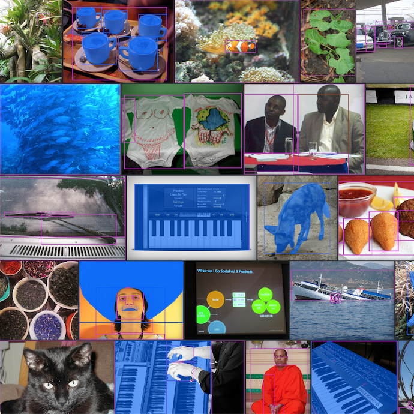
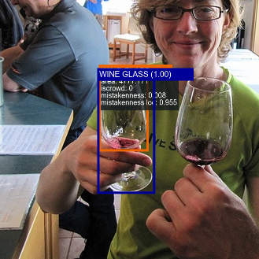

# FiftyOne Tutorials [¶](\#fiftyone-tutorials "Permalink to this headline")

Each tutorial below is a curated demonstration of how FiftyOne can help refine
your datasets and turn your good models into _great models_.

* * *

#### pandas-style queries in FiftyOne

Translate your pandas knowledge to FiftyOne. This tutorial gives a side-by-side comparison of performing common operations in pandas and FiftyOne.

Filtering,Dataset-Evaluation

#### Evaluating object detections

Aggregate statistics aren't sufficient for object detection. This tutorial shows how to use FiftyOne to perform powerful evaluation workflows on your detector.

Model-Evaluation

#### Evaluating a classifier

Evaluation made easy. This tutorial walks through an end-to-end example of fine-tuning a classifier and understanding its failure modes using FiftyOne.

Model-Evaluation

#### Using image embeddings

Visualize your data in new ways. This tutorial shows how to use FiftyOne's powerful embeddings visualization capabilities to improve your image datasets.

Visualization,Brain,Embeddings

#### Annotating with CVAT

So you've loaded and explored your data in FiftyOne... but now what? See how to send it off to CVAT for annotation in just one line of code.

Annotation,Dataset-Evaluation

#### Annotating with Labelbox

Unlock the power of the Labelbox platform. See how you can get your FiftyOne datasets annotated with just one line of code.

Annotation,Dataset-Evaluation

#### Training with Detectron2

Put your FiftyOne datasets to work and learn how to train and evaluate Detectron2 models directly on your data.

Model-Training,Model-Evaluation

#### Downloading and evaluating Open Images

Expand your data lake and evaluate your object detection models with Google's Open Images dataset and evaluation protocol, all natively within FiftyOne.

Dataset-Evaluation,Model-Evaluation,Dataset-Zoo

#### Exploring image uniqueness

Your models need diverse data. This tutorial shows how FiftyOne can remove near-duplicate images and recommend unique samples for model training.

Dataset-Evaluation,Brain

#### Finding classification mistakes

Better models start with better data. This tutorial shows how FiftyOne can automatically find label mistakes in your classification datasets.

Dataset-Evaluation,Brain

#### Finding detection mistakes

How good are your ground truth objects? Use the FiftyOne Brain's mistakenness feature to find annotation errors in your object detections.

Dataset-Evaluation,Brain

#### Nearest Neighbor Embeddings Classification with Qdrant

Easily pre-annotate your FiftyOne datasets using approximate nearest neighbors search on embeddings with Qdrant.

Dataset-Evaluation,Model-Evaluation,Embeddings

#### Fine-tuning YOLOv8 model predictions

Visualize and evaluate YOLOv8 model predictions before fine-tuning for your custom use case.

Model-Evaluation

#### Build 3D point cloud datasets with Point-E

Lidar is expensive. This tutorial shows how FiftyOne can help you construct high quality 3D point cloud datasets using Point-E point cloud models.

Dataset-Curation,Filtering,Visualization

#### Monocular Depth Estimation with Hugging Face

Metrics for monocular depth estimation can be deceiving. Run MDE models on your data and visualize their predictions with FiftyOne.

Model-Evaluation,Visualization

#### Visualizing Data with Dimensionality Reduction

Compare and contrast dimensionality reduction techniques for visualizing your data in FiftyOne.

Brain,Visualization

#### Zero-Shot Image Classification

Run and evaluate zero-shot image classification models with OpenCLIP, Hugging Face Transformers, and FiftyOne.

Filtering,Model-Evaluation,Model-Zoo

#### Augmenting Datasets with Albumentations

Learn how to apply and test out different augmentations on your datasets using FiftyOne and Albumentations.

App,Dataset-Curation,Visualization

#### Clustering Images with Embeddings

Use embeddings to cluster images in your dataset and visualize the results in FiftyOne.

App,Brain,Dataset-Curation,Embeddings,Visualization

#### Small Object Detection with SAHI

Detect small objects in your images with Slicing-Aided Hyper-Inference (SAHI) and FiftyOne.

Model-Evaluation,Model-Zoo

#### Anomaly Detection with Anomalib

Detect anomalies in your images with Anomalib and FiftyOne.

Embeddings,Model-Evaluation,Model-Training,Visualization

Note

Check out the
[fiftyone-examples](https://github.com/voxel51/fiftyone-examples)
repository for more examples of using FiftyOne!

