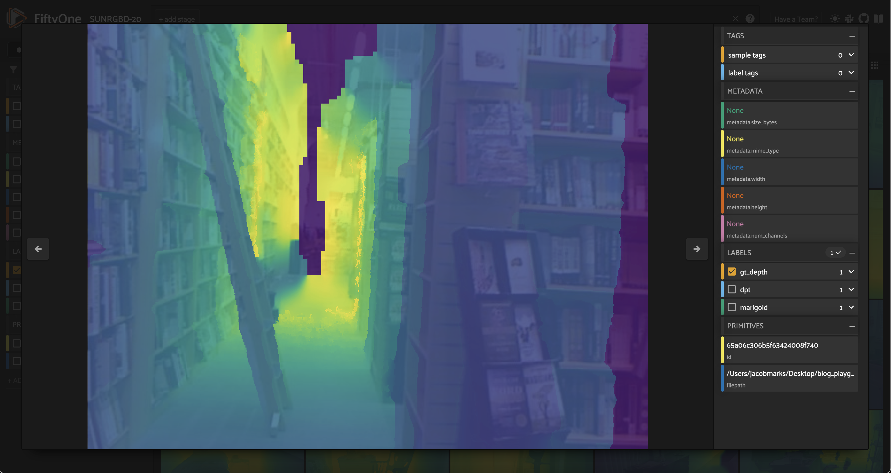

Table of Contents

- [Docs](../index.html) >

- [FiftyOne Tutorials](index.html) >
- Monocular Depth Estimation with FiftyOne

Contents


# Monocular Depth Estimation with FiftyOne [¶](\#Monocular-Depth-Estimation-with-FiftyOne "Permalink to this headline")

In this walkthrough, you’ll learn how to run monocular depth estimation models on your data using FiftyOne, Replicate, and Hugging Face libraries!

It covers the following:

- What is monocular depth estimation?

- Downloading the SUN RGB-D dataset from source and loading it into FiftyOne

- Running monocular depth estimation models on your data

- Evaluating prediction performance

- Visualizing the results in FiftyOne


## What is Monocular Depth Estimation? [¶](\#What-is-Monocular-Depth-Estimation? "Permalink to this headline")

[Monocular depth estimation](https://paperswithcode.com/task/monocular-depth-estimation) is the task of predicting the depth of a scene from _a single image_. Often, depth information is necessary for downstream tasks, such as 3D reconstruction or scene understanding. However, depth sensors are expensive and not always available.

This is a challenging task because depth is inherently ambiguous from a single image. The same scene can be projected onto the image plane in many different ways, and it is impossible to know which one is correct without additional information.

If you have multiple cameras, you can use [stereo depth estimation](https://paperswithcode.com/task/stereo-depth-estimation) techniques. But in some real world scenarios, you may be constrained to a single camera. When this is the case, you must rely on other cues, such as object size, occlusion, and perspective.

### Applications [¶](\#Applications "Permalink to this headline")

Monocular depth estimation has many applications in computer vision. For example, it can be used for:

- **3D reconstruction**: Given a single image, estimate the depth of the scene and reconstruct the 3D geometry of the scene.

- **Scene understanding**: Given a single image, estimate the depth of the scene and use it to understand the scene better.

- **Autonomous driving**: Given a single image, estimate the depth of the scene and use it to navigate the vehicle.

- **Augmented reality**: Given a single image, estimate the depth of the scene and use it to place virtual objects in the scene.


Beyond these industry applications, the ability to extract high-quality depth information from a single image has found fascinating use cases in content creation and editing, for instance:

- **Image editing**: Given a single image, estimate the depth of the scene and use it to apply depth-aware effects to the image.

- **Image generation**: Given a single image, estimate the depth of the scene and use it to generate a 3D model of the scene.

- **Depth-map guided text-to-image generation**: Given a single image, estimate the depth of the scene and use it to generate a new image that both adheres to your input text prompt and has the same depth map. (See [ControlNet](https://huggingface.co/lllyasviel/sd-controlnet-depth)!)


## Create Dataset [¶](\#Create-Dataset "Permalink to this headline")

First, we import all the necessary libraries, installing `fiftyone` if necessary:

```
[ ]:

```

```
!pip install fiftyone

```

```
[ ]:

```

```
from glob import glob
import numpy as np
from PIL import Image
import torch

import fiftyone as fo
import fiftyone.zoo as foz
import fiftyone.brain as fob
from fiftyone import ViewField as F

```

Download the SUN RGB-D dataset from [here](https://rgbd.cs.princeton.edu/) and unzip it, or use the following command to download it directly:

```
[ ]:

```

```
!curl -o sunrgbd.zip https://rgbd.cs.princeton.edu/data/SUNRGBD.zip

```

and then unzip it:

```
[ ]:

```

```
!unzip sunrgbd.zip

```

The [SUN RGB-D dataset](https://rgbd.cs.princeton.edu/) contains 10,335 RGB-D images, each of which has a corresponding RGB image, depth image, and camera intrinsics. It contains images from the [NYU depth v2](https://cs.nyu.edu/~silberman/datasets/nyu_depth_v2.html), Berkeley [B3DO](http://kinectdata.com/), and [SUN3D](https://sun3d.cs.princeton.edu/) datasets. SUN RGB-D is [one of the most popular](https://paperswithcode.com/dataset/sun-rgb-d) datasets for monocular depth
estimation and semantic segmentation tasks!

If you want to use the dataset for other tasks, you can fully convert the annotations and load them into your `fiftyone.Dataset`. However, for this tutorial, we will only be using the depth images, so we will only use the RGB images and the depth images (stored in the `depth_bfx` sub-directories).

Because we are just interested in getting the point across, we’ll restrict ourselves to the first 20 samples.

```
[3]:

```

```
dataset = fo.Dataset(name="SUNRGBD-20", persistent=True)

```

Load in images and ground truth data

```
[4]:

```

```
## restrict to 20 scenes
scene_dirs = glob("SUNRGBD/k*/*/*")[:20]

```

We will be representing depth maps with FiftyOne’s [Heatmap](https://docs.voxel51.com/user_guide/using_datasets.html#heatmaps) labels. For a thorough guide to working with heatmaps in FiftyOne, check out these [FiftyOne Heatmaps Tips and Tricks](https://voxel51.com/blog/heatmaps-fiftyone-tips-and-tricks-october-6th-2023/)!

We are going to store everything in terms of normalized, _relative_ distances, where 255 represents the maximum distance in the scene and 0 represents the minimum distance in the scene. This is a common way to represent depth maps, although it is far from the only way to do so. If we were interested in _absolute_ distances, we could store sample-wise parameters for the minimum and maximum distances in the scene, and use these to reconstruct the absolute distances from the relative distances.

```
[5]:

```

```
samples = []
for scene_dir in scene_dirs:
    ## Get image file path from scene directory
    image_path = glob(f"{scene_dir}/image/*")[0]

    ## Get depth map file path from scene directory
    depth_path = glob(f"{scene_dir}/depth_bfx/*")[0]

    depth_map = np.array(Image.open(depth_path))
    depth_map = (depth_map * 255 / np.max(depth_map)).astype("uint8")
    sample = fo.Sample(
        filepath=image_path,
        gt_depth=fo.Heatmap(map=depth_map),
    )

    samples.append(sample)

dataset.add_samples(samples);

```

```
 100% |███████████████████| 20/20 [192.2ms elapsed, 0s remaining, 104.1 samples/s]

```

We can then visualize our images and depth maps in the [FiftyOne App](https://docs.voxel51.com/user_guide/app.html):

```
[ ]:

```

```
session = fo.launch_app(dataset, auto=False)
## then open tab to localhost:5151 in browser

```


When working with depth maps, the color scheme and opacity of the heatmap are important. We can customize these as illustrated [here](https://docs.voxel51.com/user_guide/app.html#color-schemes).


### Ground Truth? [¶](\#Ground-Truth? "Permalink to this headline")

Inspecting these RGB images and depth maps, we can see that there are some inaccuracies in the ground truth depth maps. For example, in this image, the dark rift through the center of the image is actually the _farthest_ part of the scene, but the ground truth depth map shows it as the _closest_ part of the scene:



## Run Monocular Depth Estimation Models [¶](\#Run-Monocular-Depth-Estimation-Models "Permalink to this headline")

Now that we have our dataset loaded in, we can run monocular depth estimation models on it! For a long time, the state-of-the-art models for monocular depth estimation such as [DORN](https://github.com/hufu6371/DORN) and [DenseDepth](https://github.com/ialhashim/DenseDepth) were built with convolutional neural networks. Recently, however, both transformer-based models ( [DPT](https://huggingface.co/docs/transformers/model_doc/dpt),
[GLPN](https://huggingface.co/docs/transformers/model_doc/glpn)) and diffusion-based models ( [Marigold](https://huggingface.co/Bingxin/Marigold)) have achieved remarkable results!

### DPT (Transformer Models) [¶](\#DPT-(Transformer-Models) "Permalink to this headline")

The first model we’ll run is a Transformer-based model called [DPT](https://huggingface.co/docs/transformers/model_doc/dpt). The checkpoint below uses [MiDaS](https://github.com/isl-org/MiDaS/tree/master), which returns the [inverse depth map](https://pyimagesearch.com/2022/01/17/torch-hub-series-5-midas-model-on-depth-estimation/), so we have to invert it back to get a comparable depth map.

### Option 1: Run locally with Hugging Face [Transformers](https://huggingface.co/docs/transformers/index) [¶](\#Option-1:-Run-locally-with-Hugging-Face-Transformers "Permalink to this headline")

If necessary, install `transformers`:

```
[ ]:

```

```
!pip install transformers

```

```
[8]:

```

```
from transformers import AutoImageProcessor, AutoModelForDepthEstimation

image_processor = AutoImageProcessor.from_pretrained("Intel/dpt-hybrid-midas")
dpt_model = AutoModelForDepthEstimation.from_pretrained("Intel/dpt-hybrid-midas")

## you can also us a different model:
# image_processor = AutoImageProcessor.from_pretrained("Intel/dpt-large")
# dpt_model = AutoModelForDepthEstimation.from_pretrained("Intel/dpt-large")

def apply_dpt_model(sample, model, label_field):
    image = Image.open(sample.filepath)
    inputs = image_processor(images=image, return_tensors="pt")

    with torch.no_grad():
        outputs = model(**inputs)
        predicted_depth = outputs.predicted_depth

    prediction = torch.nn.functional.interpolate(
        predicted_depth.unsqueeze(1),
        size=image.size[::-1],
        mode="bicubic",
        align_corners=False,
    )

    output = prediction.squeeze().cpu().numpy()
    ## flip b/c MiDaS returns inverse depth
    formatted = (255 - output * 255 / np.max(output)).astype("uint8")

    sample[label_field] = fo.Heatmap(map=formatted)
    sample.save()

for sample in dataset.iter_samples(autosave=True, progress=True):
    apply_dpt_model(sample, dpt_model, "dpt")

```

```
 100% |███████████████████| 20/20 [15.1s elapsed, 0s remaining, 1.5 samples/s]

```

```
[ ]:

```

```
session = fo.launch_app(dataset)

```


#### Interpolating Depth Maps [¶](\#Interpolating-Depth-Maps "Permalink to this headline")

In our `apply_dpt_model()` function, between the model’s forward pass and the heatmap generation, notice that we make a call to `torch.nn.functional.interpolate()`. This is because the model’s forward pass is run on a downsampled version of the image, and we want to return a heatmap that is the same size as the original image.

Why do we need to do this? If we just want to _look_ at the heatmaps, this would not matter. But if we want to compare the ground truth depth maps to the model’s predictions on a per-pixel basis, we need to make sure that they are the same size.

#### Hugging Face Transformers Integration [¶](\#Hugging-Face-Transformers-Integration "Permalink to this headline")

In this example, we manually applied the `transformers` model to our data to generate heatmaps. In practice, we have made it even easier to apply transformer-based models (for monocular depth estimation as well as other tasks) to your data via FiftyOne’s [Hugging Face Transformers Integration](https://docs.voxel51.com/integrations/huggingface.html)!

You can load the transformer models via Hugging Face’s `transformers` library, and then just apply them to FiftyOne datasets via the `apply_model()` method:

```
[ ]:

```

```
# DPT
from transformers import DPTForDepthEstimation
model = DPTForDepthEstimation.from_pretrained("Intel/dpt-large")

# GLPN
from transformers import GLPNForDepthEstimation
model = GLPNForDepthEstimation.from_pretrained("vinvino02/glpn-kitti")

# Depth Anything
from transformers import AutoModelForDepthEstimation
model = AutoModelForDepthEstimation.from_pretrained("LiheYoung/depth-anything-small-hf")

dataset.apply_model(model, label_field="depth_predictions")

session = fo.launch_app(dataset)

```

Alternatively, you can load any Hugging Face Transformers model directly from the [FiftyOne Model Zoo](https://docs.voxel51.com/user_guide/model_zoo/index.html) via the name `depth-estimation-transformer-torch`, and specifying the model’s location on the Hugging Face Hub ( `repo_id`) via the `name_or_path` parameter. To load and apply [this DPT MiDaS hybrid model](https://huggingface.co/Intel/dpt-hybrid-midas), for instance, you would use the following:

```
[ ]:

```

```
import fiftyone.zoo as foz

model = foz.load_zoo_model(
    "depth-estimation-transformer-torch",
    name_or_path="Intel/dpt-hybrid-midas",
)

dataset.apply_model(model, label_field="dpt_hybrid_midas")
session = fo.launch_app(dataset)

```

### Option 2: Run with [Replicate](https://replicate.com/) [¶](\#Option-2:-Run-with-Replicate "Permalink to this headline")

Install the `replicate` Python client if necessary:

```
[ ]:

```

```
!pip install replicate

```

And set your API Token:

Then run the following command:

```
[ ]:

```

```
!export REPLICATE_API_TOKEN=r8_<your_token_here>

```

💡 It might take a minute for the model to load into memory on the server (cold-start problem), but once it does the prediction should only take a few seconds.

```
[ ]:

```

```
import replicate
import requests

rgb_fp = dataset.first().filepath

output = replicate.run(
    "cjwbw/midas:a6ba5798f04f80d3b314de0f0a62277f21ab3503c60c84d4817de83c5edfdae0",
    input={
        "model_type": "dpt_beit_large_512",
        "image":open(rgb_fp, "rb")
    }
)
print(output)

```

### Marigold (Diffusion Models) [¶](\#Marigold-(Diffusion-Models) "Permalink to this headline")

While diffusion is a very powerful approach to monocular depth estimation, it is also very computationally expensive and can take a while. I personally recommend going for option 2, where predictions with Replicate take about 15 seconds per image.

### Option 1: Download and run locally with Hugging Face [Diffusers](https://huggingface.co/docs/diffusers/index) [¶](\#Option-1:-Download-and-run-locally-with-Hugging-Face-Diffusers "Permalink to this headline")

Clone the Marigold GH repo:

```
[ ]:

```

```
!git clone https://github.com/prs-eth/Marigold.git

```

```
[ ]:

```

```
from Marigold.marigold import MarigoldPipeline
pipe = MarigoldPipeline.from_pretrained("Bingxin/Marigold")

```

Then prediction looks like:

```
[ ]:

```

```
rgb_image = Image.open(dataset.first().filepath)
output = pipe(rgb_image)
depth_image = output['depth_colored']

```

### Option 2: Run via [Replicate](https://replicate.com/) [¶](\#Option-2:-Run-via-Replicate "Permalink to this headline")

💡 It might take a minute for the model to load into memory on the server (cold-start problem), but once it does the prediction should only take a few seconds.

```
[29]:

```

```
import replicate
import requests
import io

def marigold_model(rgb_image):
    output = replicate.run(
        "adirik/marigold:1a363593bc4882684fc58042d19db5e13a810e44e02f8d4c32afd1eb30464818",
        input={
            "image":rgb_image
        }
    )
    ## get the black and white depth map
    response = requests.get(output[1]).content
    return response

def apply_marigold_model(sample, model, label_field):
    rgb_image = open(sample.filepath, "rb")
    response = model(rgb_image)
    depth_image = np.array(Image.open(io.BytesIO(response)))[:, :, 0] ## all channels are the same
    formatted = (255 - depth_image).astype("uint8")
    sample[label_field] = fo.Heatmap(map=formatted)
    sample.save()

for sample in dataset.iter_samples(autosave=True, progress=True):
    apply_marigold_model(sample, marigold_model, "marigold")

```

```
 100% |███████████████████| 20/20 [5.3m elapsed, 0s remaining, 0.1 samples/s]

```

```
[ ]:

```

```
session = fo.launch_app(dataset)

```


## Evaluate Predictions [¶](\#Evaluate-Predictions "Permalink to this headline")

Now that we have predictions from multiple models, let’s evaluate them! We will leverage sklearn to apply three simple metrics commonly used for monocular depth estimation: [root mean squared error (RMSE)](https://en.wikipedia.org/wiki/Root-mean-square_deviation), [peak signal to noise ratio (PSNR)](https://en.wikipedia.org/wiki/Peak_signal-to-noise_ratio), and [structural similarity index (SSIM)](https://en.wikipedia.org/wiki/Structural_similarity).

💡 Higher PSNR and SSIM scores indicate better predictions, while lower RMSE scores indicate better predictions.

```
[38]:

```

```
from skimage.metrics import peak_signal_noise_ratio, mean_squared_error, structural_similarity

def rmse(gt, pred):
    """Compute root mean squared error between ground truth and prediction"""
    return np.sqrt(mean_squared_error(gt, pred))

```

```
[48]:

```

```
def evaluate_depth(dataset, prediction_field, gt_field):
    for sample in dataset.iter_samples(autosave=True, progress=True):
        gt_map = sample[gt_field].map
        pred = sample[prediction_field]
        pred_map = pred.map
        pred["rmse"] = rmse(gt_map, pred_map)
        pred["psnr"] = peak_signal_noise_ratio(gt_map, pred_map)
        pred["ssim"] = structural_similarity(gt_map, pred_map)
        sample[prediction_field] = pred

    ## add dynamic fields to dataset so we can view them in the App
    dataset.add_dynamic_sample_fields()

```

```
[ ]:

```

```
evaluate_depth(dataset, "dpt", "gt_depth")
evaluate_depth(dataset, "marigold", "gt_depth")

```

We can then compute average metrics across the entire dataset very easily:

```
[66]:

```

```
print("Mean Error Metrics")
for model in ["dpt", "marigold"]:
    print("-"*50)
    for metric in ["rmse", "psnr", "ssim"]:
        mean_metric_value = dataset.mean(f"{model}.{metric}")
        print(f"Mean {metric} for {model}: {mean_metric_value}")

```

```
Mean Error Metrics
--------------------------------------------------
Mean rmse for dpt: 49.8915828817003
Mean psnr for dpt: 14.805904629602551
Mean ssim for dpt: 0.8398022368184576
--------------------------------------------------
Mean rmse for marigold: 104.0061165272178
Mean psnr for marigold: 7.93015537185192
Mean ssim for marigold: 0.42766803372861134

```

All of the metrics seem to agree that DPT outperforms Marigold. However, it is important to note that these metrics are not perfect. For example, RMSE is very sensitive to outliers, and SSIM is not very sensitive to small errors. For a more thorough evaluation, we can filter by these metrics in the app in order to visualize what the model is doing well and what it is doing poorly — or where the metrics are failing to capture the model’s performance.

Toggling masks on and off is a great way to visualize the differences between the ground truth and the model’s predictions:


## Key Challenges with Monocular Depth Estimation [¶](\#Key-Challenges-with-Monocular-Depth-Estimation "Permalink to this headline")

Now that we’ve explored some model predictions, let’s quickly recap some of the key challenges with monocular depth estimation:

### Data quality and quantity [¶](\#Data-quality-and-quantity "Permalink to this headline")

Ground truth data is hard to come by, and is often noisy. For example, the SUN RGB-D dataset contains 10,335 RGB-D images, which is a lot, but it is still a relatively small dataset compared to other datasets such as ImageNet, which contains 1.2 million images. And in many cases, the ground truth data is noisy. For example, the ground truth depth maps in the SUN RGB-D dataset are generated by projecting the 3D point clouds onto the 2D image plane, and then computing the Euclidean distance
between the projected points and the camera. This process is inherently noisy, and the resulting depth maps are often noisy as well.

### Poor generalization [¶](\#Poor-generalization "Permalink to this headline")

Models often struggle to generalize to new environments. Outdoors, for example, is a very different environment than indoors, and models trained on indoor data often fail to generalize to outdoor data.

### Precarious metrics [¶](\#Precarious-metrics "Permalink to this headline")

Metrics are not always a good indicator of model performance. For example, a model might have a low RMSE, but still produce very noisy depth maps. This is why it is important to look at the depth maps themselves, and not just the metrics!

## Summary [¶](\#Summary "Permalink to this headline")

In this walkthrough, we learned how to run monocular depth estimation models on your data using FiftyOne, Replicate, and Hugging Face libraries! We also learned how to evaluate the predictions using common metrics, and how to visualize the results in FiftyOne. In real-world applications, it is important to look at the depth maps themselves, and not just the metrics! It is also important to understand that model performance is limited by the quality, quantity, and diversity of data they are
trained on.

- Monocular Depth Estimation with FiftyOne
  - [What is Monocular Depth Estimation?](#What-is-Monocular-Depth-Estimation?)
    - [Applications](#Applications)
  - [Create Dataset](#Create-Dataset)
    - [Ground Truth?](#Ground-Truth?)
  - [Run Monocular Depth Estimation Models](#Run-Monocular-Depth-Estimation-Models)
    - [DPT (Transformer Models)](#DPT-(Transformer-Models))
    - [Option 1: Run locally with Hugging Face Transformers](#Option-1:-Run-locally-with-Hugging-Face-Transformers)
      - [Interpolating Depth Maps](#Interpolating-Depth-Maps)
      - [Hugging Face Transformers Integration](#Hugging-Face-Transformers-Integration)
    - [Option 2: Run with Replicate](#Option-2:-Run-with-Replicate)
    - [Marigold (Diffusion Models)](#Marigold-(Diffusion-Models))
    - [Option 1: Download and run locally with Hugging Face Diffusers](#Option-1:-Download-and-run-locally-with-Hugging-Face-Diffusers)
    - [Option 2: Run via Replicate](#Option-2:-Run-via-Replicate)
  - [Evaluate Predictions](#Evaluate-Predictions)
  - [Key Challenges with Monocular Depth Estimation](#Key-Challenges-with-Monocular-Depth-Estimation)
    - [Data quality and quantity](#Data-quality-and-quantity)
    - [Poor generalization](#Poor-generalization)
    - [Precarious metrics](#Precarious-metrics)
  - [Summary](#Summary)