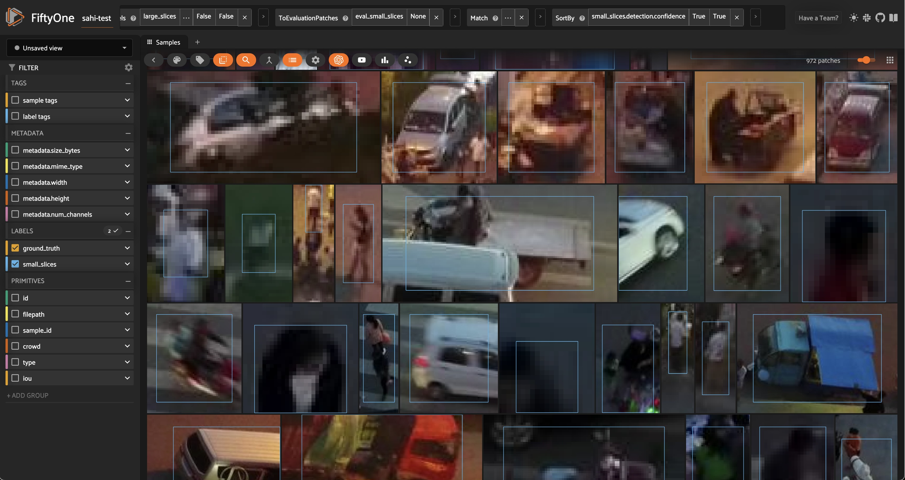

# Detecting Small Objects with SAHI [¶](\#Detecting-Small-Objects-with-SAHI "Permalink to this headline")


Object detection is one of the fundamental tasks in computer vision, but detecting small objects can be particularly challenging.

In this walkthrough, you’ll learn how to use a technique called [SAHI (Slicing Aided Hyper Inference)](https://ieeexplore.ieee.org/document/9897990) in conjunction with state-of-the-art object detection models to improve the detection of small objects. We’ll apply SAHI with Ultralytics’ YOLOv8 model to detect small objects in the VisDrone dataset, and then evaluate these predictions to better understand how slicing impacts detection performance.

It covers the following:

- Loading the VisDrone dataset from the Hugging Face Hub

- Applying Ultralytics’ YOLOv8 model to the dataset

- Using SAHI to run inference on slices of the images

- Evaluating model performance with and without SAHI


## Setup and Installation [¶](\#Setup-and-Installation "Permalink to this headline")

For this walkthrough, we’ll be using the following libraries:

- `fiftyone` for dataset exploration and manipulation

- `huggingface_hub` for loading the VisDrone dataset

- `ultralytics` for running object detection with YOLOv8

- `sahi` for slicing aided hyper inference


If you haven’t already, install the latest versions of these libraries:

```python
[62]:

```

```python
pip install -U fiftyone sahi ultralytics huggingface_hub --quiet

```

```python
Note: you may need to restart the kernel to use updated packages.

```

Let’s get started! 🚀

First, import the necessary modules from FiftyOne:

```python
[1]:

```

```python
import fiftyone as fo
import fiftyone.zoo as foz
import fiftyone.utils.huggingface as fouh
from fiftyone import ViewField as F

```

Now, let’s download some data. We’ll be taking advantage of FiftyOne’s [Hugging Face Hub integration](https://docs.voxel51.com/integrations/huggingface.html#huggingface-hub) to load a subset of the [VisDrone dataset](https://github.com/VisDrone/VisDrone-Dataset) directly from the [Hugging Face Hub](https://huggingface.co/docs/hub/en/index):

```python
[17]:

```

```python
dataset = fouh.load_from_hub("Voxel51/VisDrone2019-DET", name="sahi-test", max_samples=100, overwrite=True)

```

```python
Downloading config file fiftyone.yml from Voxel51/VisDrone2019-DET
Loading dataset
Importing samples...
 100% |█████████████████| 100/100 [33.1ms elapsed, 0s remaining, 3.0K samples/s]

```

Before adding any predictions, let’s take a look at the dataset:

```python
[22]:

```

```python
session = fo.launch_app(dataset)

```

```python
Session launched. Run `session.show()` to open the App in a cell output.

```


## Standard Inference with YOLOv8 [¶](\#Standard-Inference-with-YOLOv8 "Permalink to this headline")

Now that we know what our data looks like, let’s run our standard inference pipeline with a YOLOv8 (large-variant) model. We can load the model from Ultralytics and then apply this directly to our FiftyOne dataset using `apply_model()`, thanks to [FiftyOne’s Ultralytics integration](https://docs.voxel51.com/integrations/ultralytics.html):

```python
[26]:

```

```python
from ultralytics import YOLO

ckpt_path = "yolov8l.pt"
model = YOLO(ckpt_path)
## fiftyone will work directly with the Ultralytics.YOLO model

dataset.apply_model(model, label_field="base_model")

```

```python
 100% |█████████████████| 100/100 [25.0s elapsed, 0s remaining, 4.0 samples/s]

```

Alternatively, if we want FiftyOne to handle the model downloading and location management for us, we can load the same model directly from the [FiftyOne Model Zoo](https://docs.voxel51.com/user_guide/model_zoo/index.html):

```python
[ ]:

```

```python
## comment this out if you want to use the model from the zoo
# model = foz.load_zoo_model("yolov8l-coco-torch")
# ckpt_path = model.config.model_path
# dataset.apply_model(model, label_field="base_model")

```

Now that we have predictions, we can visualize them in the App:

```python
[ ]:

```

```python
session = fo.launch_app(dataset)

```


Looking at the model’s predictions next to the ground truth, we can see a few things.

First and foremost, the classes detected by our _YOLOv8l_ model are different from the ground truth classes in the VisDrone dataset. Our YOLO model was trained on the [COCO dataset](https://docs.voxel51.com/user_guide/dataset_zoo/datasets.html#coco-2017), which has 80 classes, while the VisDrone dataset has 12 classes, including an `ignore_regions` class. To simplify the comparison, we’ll focus on just the few most common classes in the dataset, and will map the VisDrone classes to the COCO
classes as follows:

```python
[6]:

```

```python
mapping = {"pedestrians": "person", "people": "person", "van": "car"}
mapped_view = dataset.map_labels("ground_truth", mapping)

```

And then filter our labels to only include the classes we’re interested in:

```python
[20]:

```

```python
def get_label_fields(sample_collection):
    """Get the (detection) label fields of a Dataset or DatasetView."""
    label_fields = list(
        sample_collection.get_field_schema(embedded_doc_type=fo.Detections).keys()
    )
    return label_fields

def filter_all_labels(sample_collection):
    label_fields = get_label_fields(sample_collection)

    filtered_view = sample_collection

    for lf in label_fields:
        filtered_view = filtered_view.filter_labels(
            lf, F("label").is_in(["person", "car", "truck"]), only_matches=False
        )
    return filtered_view

```

```python
[51]:

```

```python
filtered_view = filter_all_labels(mapped_view)

```

```python
[52]:

```

```python
session.view = filtered_view.view()

```


Now that the classes are aligned and we’ve reduced the crowding in our images, we can see that while the model does a pretty good job of detecting objects, it struggles with the small objects, especially people in the distance. This can happen with large images, as most detection models are trained on fixed-size images. As an example, YOLOv8 is trained on images with maximum side length 640640. When we feed it an image of size 19201920 x 10801080, the model will downsample the image
to 640640 x 360360 before making predictions. This downsampling can cause small objects to be missed, as the model may not have enough information to detect them.

## Detecting Small Objects with SAHI [¶](\#id1 "Permalink to this headline")

Theoretically, one could train a model on larger images to improve detection of small objects, but this would require more memory and computational power. Another option is to introduce a sliding window approach, where we split the image into smaller patches, run the model on each patch, and then combine the results. This is the idea behind [Slicing Aided Hyper Inference](https://github.com/obss/sahi) (SAHI), which we’ll use to improve the detection of small objects in the VisDrone dataset!


Illustration of Slicing Aided Hyper Inference. Image courtesy of SAHI Github Repo.

The SAHI technique is implemented in the `sahi` Python package that we installed earlier. SAHI is a framework which is compatible with many object detection models, including YOLOv8. We can choose the detection model we want to use and create an instance of any of the classes that subclass `sahi.models.DetectionModel`, including YOLOv8, YOLOv5, and even Hugging Face Transformers models. We will create our model object using SAHI’s `AutoDetectionModel` class, specifying the model type and
the path to the checkpoint file:

```python
[7]:

```

```python
from sahi import AutoDetectionModel
from sahi.predict import get_prediction, get_sliced_prediction

```

```python
[11]:

```

```python
detection_model = AutoDetectionModel.from_pretrained(
    model_type='yolov8',
    model_path=ckpt_path,
    confidence_threshold=0.25, ## same as the default value for our base model
    image_size=640,
    device="cpu", # or 'cuda'
)

```

Before we generate sliced predictions, let’s inspect the model’s predictions on a trial image, using SAHI’s `get_prediction()` function:

```python
[60]:

```

```python
result = get_prediction(dataset.first().filepath, detection_model, verbose=0)
print(result)

```

```python
<sahi.prediction.PredictionResult object at 0x2b0e9c250>

```

Fortunately, SAHI results objects have a `to_fiftyone_detections()` method, which converts the results to FiftyOne detections:

```python
[61]:

```

```python
print(result.to_fiftyone_detections())

```

```python
[<Detection: {\
    'id': '661858c20ae3edf77139db7a',\
    'attributes': {},\
    'tags': [],\
    'label': 'car',\
    'bounding_box': [\
        0.6646394729614258,\
        0.7850866247106482,\
        0.06464214324951172,\
        0.09088355170355902,\
    ],\
    'mask': None,\
    'confidence': 0.8933132290840149,\
    'index': None,\
}>, <Detection: {\
    'id': '661858c20ae3edf77139db7b',\
    'attributes': {},\
    'tags': [],\
    'label': 'car',\
    'bounding_box': [\
        0.6196376800537109,\
        0.7399617513020833,\
        0.06670347849527995,\
        0.09494832356770834,\
    ],\
    'mask': None,\
    'confidence': 0.8731599450111389,\
    'index': None,\
}>, <Detection: {\
    'id': '661858c20ae3edf77139db7c',\
    'attributes': {},\
    'tags': [],\
    'label': 'car',\
    'bounding_box': [\
        0.5853352228800456,\
        0.7193766276041667,\
        0.06686935424804688,\
        0.07682359483506944,\
    ],\
    'mask': None,\
    'confidence': 0.8595829606056213,\
    'index': None,\
}>, <Detection: {\
    'id': '661858c20ae3edf77139db7d',\
    'attributes': {},\
    'tags': [],\
    'label': 'car',\
    'bounding_box': [\
        0.5635160446166992,\
        0.686444091796875,\
        0.06365642547607422,\
        0.06523607042100694,\
    ],\
    'mask': None,\
    'confidence': 0.854781448841095,\
    'index': None,\
}>, <Detection: {\
    'id': '661858c20ae3edf77139db7e',\
    'attributes': {},\
    'tags': [],\
    'label': 'car',\
    'bounding_box': [\
        0.7365047454833984,\
        0.8709894816080729,\
        0.07815799713134766,\
        0.06583930121527778,\
    ],\
    'mask': None,\
    'confidence': 0.8482972383499146,\
    'index': None,\
}>, <Detection: {\
    'id': '661858c20ae3edf77139db7f',\
    'attributes': {},\
    'tags': [],\
    'label': 'car',\
    'bounding_box': [\
        0.4387975692749023,\
        0.7973368326822917,\
        0.07478656768798828,\
        0.08685709635416666,\
    ],\
    'mask': None,\
    'confidence': 0.8482537865638733,\
    'index': None,\
}>, <Detection: {\
    'id': '661858c20ae3edf77139db80',\
    'attributes': {},\
    'tags': [],\
    'label': 'car',\
    'bounding_box': [\
        0.41441831588745115,\
        0.7553463971173322,\
        0.07797966003417969,\
        0.09232432047526042,\
    ],\
    'mask': None,\
    'confidence': 0.8444766402244568,\
    'index': None,\
}>, <Detection: {\
    'id': '661858c20ae3edf77139db81',\
    'attributes': {},\
    'tags': [],\
    'label': 'car',\
    'bounding_box': [\
        0.4094355583190918,\
        0.7256359524197049,\
        0.07238206863403321,\
        0.07048272026909722,\
    ],\
    'mask': None,\
    'confidence': 0.798665463924408,\
    'index': None,\
}>, <Detection: {\
    'id': '661858c20ae3edf77139db82',\
    'attributes': {},\
    'tags': [],\
    'label': 'car',\
    'bounding_box': [\
        0.5339123407999674,\
        0.6121687712492766,\
        0.07190316518147787,\
        0.07292734781901042,\
    ],\
    'mask': None,\
    'confidence': 0.7936845421791077,\
    'index': None,\
}>, <Detection: {\
    'id': '661858c20ae3edf77139db83',\
    'attributes': {},\
    'tags': [],\
    'label': 'car',\
    'bounding_box': [\
        0.03444666067759196,\
        0.5164913601345487,\
        0.03219949007034302,\
        0.06044175889756945,\
    ],\
    'mask': None,\
    'confidence': 0.740483820438385,\
    'index': None,\
}>, <Detection: {\
    'id': '661858c20ae3edf77139db84',\
    'attributes': {},\
    'tags': [],\
    'label': 'car',\
    'bounding_box': [\
        0.3923538525899251,\
        0.6745626378942419,\
        0.06798810958862304,\
        0.07528584798177083,\
    ],\
    'mask': None,\
    'confidence': 0.6714914441108704,\
    'index': None,\
}>, <Detection: {\
    'id': '661858c20ae3edf77139db85',\
    'attributes': {},\
    'tags': [],\
    'label': 'car',\
    'bounding_box': [\
        0.5216399192810058,\
        0.5886645846896701,\
        0.06560036341349283,\
        0.059334818522135416,\
    ],\
    'mask': None,\
    'confidence': 0.6649367809295654,\
    'index': None,\
}>, <Detection: {\
    'id': '661858c20ae3edf77139db86',\
    'attributes': {},\
    'tags': [],\
    'label': 'car',\
    'bounding_box': [\
        0.5096873283386231,\
        0.5273054334852431,\
        0.0551149050394694,\
        0.07670672381365741,\
    ],\
    'mask': None,\
    'confidence': 0.6273276805877686,\
    'index': None,\
}>, <Detection: {\
    'id': '661858c20ae3edf77139db87',\
    'attributes': {},\
    'tags': [],\
    'label': 'car',\
    'bounding_box': [\
        0.37222995758056643,\
        0.5739804303204572,\
        0.06103067398071289,\
        0.06263699001736112,\
    ],\
    'mask': None,\
    'confidence': 0.5973840355873108,\
    'index': None,\
}>, <Detection: {\
    'id': '661858c20ae3edf77139db88',\
    'attributes': {},\
    'tags': [],\
    'label': 'car',\
    'bounding_box': [\
        0.05044105052947998,\
        0.44830712212456597,\
        0.02773451805114746,\
        0.054146491156684025,\
    ],\
    'mask': None,\
    'confidence': 0.5668562054634094,\
    'index': None,\
}>, <Detection: {\
    'id': '661858c20ae3edf77139db89',\
    'attributes': {},\
    'tags': [],\
    'label': 'car',\
    'bounding_box': [\
        0.38649218877156577,\
        0.6419422290943287,\
        0.0629791259765625,\
        0.05787251790364583,\
    ],\
    'mask': None,\
    'confidence': 0.525834858417511,\
    'index': None,\
}>, <Detection: {\
    'id': '661858c20ae3edf77139db8a',\
    'attributes': {},\
    'tags': [],\
    'label': 'car',\
    'bounding_box': [\
        3.7088990211486816e-05,\
        0.5483550460250289,\
        0.027724572022755942,\
        0.06541680230034722,\
    ],\
    'mask': None,\
    'confidence': 0.5090425610542297,\
    'index': None,\
}>]

```

This makes our lives easy, so we can focus on the data and not the nitty gritty details of format conversions.

SAHI’s `get_sliced_prediction()` function works in the same way as `get_prediction()`, with a few additional hyperparameters that let us configure how the image is sliced. In particular, we can specify the slice height and width, and the overlap between slices. Here’s an example:

```python
[ ]:

```

```python
sliced_result = get_sliced_prediction(
    dataset.skip(40).first().filepath,
    detection_model,
    slice_height = 320,
    slice_width = 320,
    overlap_height_ratio = 0.2,
    overlap_width_ratio = 0.2,
)

```

As a sanity check, we can compare the number of detections in the sliced predictions to the number of detections in the original predictions:

```python
[91]:

```

```python
num_sliced_dets = len(sliced_result.to_fiftyone_detections())
num_orig_dets = len(result.to_fiftyone_detections())

print(f"Detections predicted without slicing: {num_orig_dets}")
print(f"Detections predicted with slicing: {num_sliced_dets}")

```

```python
Detections predicted without slicing: 17
Detections predicted with slicing: 73

```

We can see that the number of predictions increased substantially! We have yet to determine if the additional predictions are valid, or if we just have more false positives. We’ll do this using [FiftyOne’s Evaluation API](https://docs.voxel51.com/user_guide/evaluation.html) shortly. We also want to find a good set of hyperparameters for our slicing. To do all of these things, we’re going to need to apply SAHI to the entire dataset. Let’s do that now!

To simplify the process, we’ll define a function that adds predictions to a sample in a specified label field, and then we will iterate over the dataset, applying the function to each sample. This function will pass the sample’s filepath and slicing hyperparameters to `get_sliced_prediction()`, and then add the predictions to the sample in the specified label field:

```python
[70]:

```

```python
def predict_with_slicing(sample, label_field, **kwargs):
    result = get_sliced_prediction(
        sample.filepath, detection_model, verbose=0, **kwargs
    )
    sample[label_field] = fo.Detections(detections=result.to_fiftyone_detections())

```

We’ll keep the slice overlap fixed at 0.20.2, and see how the slice height and width affect the quality of the predictions:

```python
[92]:

```

```python
kwargs = {"overlap_height_ratio": 0.2, "overlap_width_ratio": 0.2}

for sample in dataset.iter_samples(progress=True, autosave=True):
    predict_with_slicing(sample, label_field="small_slices", slice_height=320, slice_width=320, **kwargs)
    predict_with_slicing(sample, label_field="large_slices", slice_height=480, slice_width=480, **kwargs)

```

```python
 100% |█████████████████| 100/100 [13.6m elapsed, 0s remaining, 0.1 samples/s]

```

```python
04/12/2024 10:06:59 - INFO - eta.core.utils -    100% |█████████████████| 100/100 [13.6m elapsed, 0s remaining, 0.1 samples/s]

```

Note how these inference times are much longer than the original inference time. This is because we’re running the model on multiple slices _per_ image, which increases the number of forward passes the model has to make. This is a trade-off we’re making to improve the detection of small objects.

Now let’s once again filter our labels to only include the classes we’re interested in, and visualize the results in the FiftyOne App:

```python
[14]:

```

```python
filtered_view = filter_all_labels(mapped_view)

```

```python
[98]:

```

```python
session = fo.launch_app(filtered_view, auto=False)

```

```python
Session launched. Run `session.show()` to open the App in a cell output.

```

```python
04/12/2024 10:18:33 - INFO - fiftyone.core.session.session -   Session launched. Run `session.show()` to open the App in a cell output.

```


The results certainly look promising! From a few visual examples, slicing seems to improve the coverage of ground truth detections, and smaller slices in particular seem to lead to more of the `person` detections being captured. But how can we know for sure? Let’s run an evaluation routine to mark the detections as true positives, false positives, or false negatives, so that we can compare the sliced predictions to the ground truth. We’ll use our filtered view’s `evaluate_detections()`
method to do this:

## Evaluating SAHI Predictions [¶](\#Evaluating-SAHI-Predictions "Permalink to this headline")

### Using FiftyOne’s Evaluation API [¶](\#Using-FiftyOne’s-Evaluation-API "Permalink to this headline")

Sticking with our filtered view of the dataset, let’s run an evaluation routine comparing our predictions from each of the prediction label fields to the ground truth labels. We will use the `evaluate_detections()` method, which will mark each detection as a true positive, false positive, or false negative. Here we use the default IoU threshold of 0.50.5, but you can adjust this as needed:

```python
[ ]:

```

```python
base_results = filtered_view.evaluate_detections("base_model", gt_field="ground_truth", eval_key="eval_base_model")
large_slice_results = filtered_view.evaluate_detections("large_slices", gt_field="ground_truth", eval_key="eval_large_slices")
small_slice_results = filtered_view.evaluate_detections("small_slices", gt_field="ground_truth", eval_key="eval_small_slices")

```

Let’s print a report for each:

```python
[107]:

```

```python
print("Base model results:")
base_results.print_report()

print("-" * 50)
print("Large slice results:")
large_slice_results.print_report()

print("-" * 50)
print("Small slice results:")
small_slice_results.print_report()

```

```python
Base model results:
              precision    recall  f1-score   support

         car       0.81      0.55      0.66       692
      person       0.94      0.16      0.28      7475
       truck       0.66      0.34      0.45       265

   micro avg       0.89      0.20      0.33      8432
   macro avg       0.80      0.35      0.46      8432
weighted avg       0.92      0.20      0.31      8432

--------------------------------------------------
Large slice results:
              precision    recall  f1-score   support

         car       0.67      0.71      0.69       692
      person       0.89      0.34      0.49      7475
       truck       0.55      0.45      0.49       265

   micro avg       0.83      0.37      0.51      8432
   macro avg       0.70      0.50      0.56      8432
weighted avg       0.86      0.37      0.51      8432

--------------------------------------------------
Small slice results:
              precision    recall  f1-score   support

         car       0.66      0.75      0.70       692
      person       0.84      0.42      0.56      7475
       truck       0.49      0.46      0.47       265

   micro avg       0.80      0.45      0.57      8432
   macro avg       0.67      0.54      0.58      8432
weighted avg       0.82      0.45      0.57      8432

```

We can see that as we introduce more slices, the number of false positives increases, while the number of false negatives decreases. This is expected, as the model is able to detect more objects with more slices, but also makes more mistakes! You could apply more agressive confidence thresholding to combat this increase in false positives, but even without doing this the F1F1-score has significantly improved.

### Evaluating Performance on Small Objects [¶](\#Evaluating-Performance-on-Small-Objects "Permalink to this headline")

Let’s dive a little bit deeper into these results. We noted earlier that the model struggles with small objects, so let’s see how these three approaches fare on objects smaller than 32×3232×32 pixels. We can perform this filtering using FiftyOne’s [ViewField](https://docs.voxel51.com/recipes/creating_views.html#View-expressions):

```python
[110]:

```

```python
## Filtering for only small boxes

box_width, box_height = F("bounding_box")[2], F("bounding_box")[3]
rel_bbox_area = box_width * box_height

im_width, im_height = F("$metadata.width"), F("$metadata.height")
abs_area = rel_bbox_area * im_width * im_height

small_boxes_view = filtered_view
for lf in get_label_fields(filtered_view):
    small_boxes_view = small_boxes_view.filter_labels(lf, abs_area < 32**2, only_matches=False)

```

```python
[111]:

```

```python
session.view = small_boxes_view.view()

```


```python
[112]:

```

```python
small_boxes_base_results = small_boxes_view.evaluate_detections("base_model", gt_field="ground_truth", eval_key="eval_small_boxes_base_model")
small_boxes_large_slice_results = small_boxes_view.evaluate_detections("large_slices", gt_field="ground_truth", eval_key="eval_small_boxes_large_slices")
small_boxes_small_slice_results = small_boxes_view.evaluate_detections("small_slices", gt_field="ground_truth", eval_key="eval_small_boxes_small_slices")

```

```python
Evaluating detections...

```

```python
04/12/2024 10:54:36 - INFO - fiftyone.utils.eval.detection -   Evaluating detections...

```

```python
 100% |█████████████████| 100/100 [1.1m elapsed, 0s remaining, 7.8 samples/s]

```

```python
04/12/2024 10:55:44 - INFO - eta.core.utils -    100% |█████████████████| 100/100 [1.1m elapsed, 0s remaining, 7.8 samples/s]

```

```python
Evaluating detections...

```

```python
04/12/2024 10:55:44 - INFO - fiftyone.utils.eval.detection -   Evaluating detections...

```

```python
 100% |█████████████████| 100/100 [1.2m elapsed, 0s remaining, 6.2 samples/s]

```

```python
04/12/2024 10:56:59 - INFO - eta.core.utils -    100% |█████████████████| 100/100 [1.2m elapsed, 0s remaining, 6.2 samples/s]

```

```python
Evaluating detections...

```

```python
04/12/2024 10:56:59 - INFO - fiftyone.utils.eval.detection -   Evaluating detections...

```

```python
 100% |█████████████████| 100/100 [1.4m elapsed, 0s remaining, 5.7 samples/s]

```

```python
04/12/2024 10:58:23 - INFO - eta.core.utils -    100% |█████████████████| 100/100 [1.4m elapsed, 0s remaining, 5.7 samples/s]

```

```python
[113]:

```

```python
print("Small Box — Base model results:")
small_boxes_base_results.print_report()

print("-" * 50)
print("Small Box — Large slice results:")
small_boxes_large_slice_results.print_report()

print("-" * 50)
print("Small Box — Small slice results:")
small_boxes_small_slice_results.print_report()

```

```python
Small Box — Base model results:
              precision    recall  f1-score   support

         car       0.71      0.25      0.37       147
      person       0.83      0.08      0.15      5710
       truck       0.00      0.00      0.00        28

   micro avg       0.82      0.08      0.15      5885
   macro avg       0.51      0.11      0.17      5885
weighted avg       0.82      0.08      0.15      5885

--------------------------------------------------
Small Box — Large slice results:
              precision    recall  f1-score   support

         car       0.46      0.48      0.47       147
      person       0.82      0.23      0.35      5710
       truck       0.20      0.07      0.11        28

   micro avg       0.78      0.23      0.36      5885
   macro avg       0.49      0.26      0.31      5885
weighted avg       0.80      0.23      0.36      5885

--------------------------------------------------
Small Box — Small slice results:
              precision    recall  f1-score   support

         car       0.42      0.53      0.47       147
      person       0.79      0.31      0.45      5710
       truck       0.21      0.18      0.19        28

   micro avg       0.75      0.32      0.45      5885
   macro avg       0.47      0.34      0.37      5885
weighted avg       0.77      0.32      0.45      5885

```

This makes the value of SAHI crystal clear! The recall when using SAHI is much higher for small objects without significant dropoff in precision, leading to improved F1-score. This is especially pronounced for `person` detections, where the F1F1 score is tripled!

### Identifying Edge Cases [¶](\#Identifying-Edge-Cases "Permalink to this headline")

Now that we know SAHI is effective at detecting small objects, let’s look at the places where our predictions are most confident but do not align with the ground truth labels. We can do this by creating an evaluation patches view, filtering for predictions tagged as false positives and sorting by confidence:

```python
[18]:

```

```python
high_conf_fp_view = filtered_view.to_evaluation_patches(eval_key="eval_small_slices").match(F("type")=="fp").sort_by("small_slices.detection.confidence")

```

```python
[19]:

```

```python
session.view = high_conf_fp_view.view()

```



Looking at these results, we can see that in many cases, our predictions look quite reasonable, and it seems that the ground truth labels are missing! This is certainly not the case for every prediction, but there are definitely enough to motivate a relabeling of the ground truth data. This is where human-in-the-loop (HITL) workflows can be very useful, as they allow human annotators to review and correct the labels. After this process, we can reevaluate our trained models (with or without SAHI)
on the updated dataset, and then train new models on the updated data.

## Summary [¶](\#Summary "Permalink to this headline")

In this walkthrough, we’ve covered how to add SAHI predictions to your data, and then rigorously evaluate the impacts of slicing on prediction quality. We’ve seen how slicing-aided hyper-inference (SAHI) can improve the recall and F1F1-score for detection, especially for small objects, without needing to train a model on larger images.

To maximize the effectiveness of SAHI, you may want to experiment with the following:

- Slicing hyperparameters, such as slice height and width, and overlap.

- Base object detection models, as SAHI is compatible with many models, including YOLOv5, and Hugging Face Transformers models.

- Confidence thresholding (potentially on a class-by-class basis), to reduce the number of false positives.

- Post-processing techniques, such as [non-maximum suppression (NMS)](https://docs.voxel51.com/api/fiftyone.utils.labels.html#fiftyone.utils.labels.perform_nms), to reduce the number of overlapping detections.

- Human-in-the-loop (HITL) workflows, to correct ground truth labels.


You will also want to determine which evaluation metrics make the most sense for your use case!

## Additional Resources [¶](\#Additional-Resources "Permalink to this headline")

If you found this tutorial helpful, you may also be interested in the following resources:

- [Tutorial on Evaluating Object Detections](https://docs.voxel51.com/tutorials/evaluate_detections.html)

- [Tutorial on Finding Object Detection Mistakes](https://docs.voxel51.com/tutorials/detection_mistakes.html)

- [Tutorial on Fine-tuning YOLOv8 on Custom Data](https://docs.voxel51.com/tutorials/yolov8.html)

- [FiftyOne Plugin for Comparing Models on Specific Detections](https://github.com/allenleetc/model-comparison)


